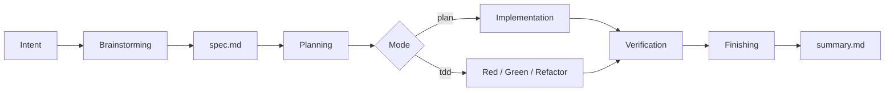

<p align="center">
  <h1 align="center">Lattice</h1>
  <p align="center">
    <strong>面向团队的 AI Coding 工程框架</strong>
  </p>
  <p align="center">
    <a href="README.en.md">English</a> ·
    <a href="docs/wiki/">设计 Wiki</a> ·
    <a href="docs/adapters/">Agent 适配器</a> ·
    <a href="examples/go-gin-gorm/">示例</a> ·
    <a href="CHANGELOG.md">更新日志</a>
  </p>
</p>

---

## Lattice 是什么

Lattice 是一个安装到项目仓库里的 AI Coding 工程框架。它不替代 Claude Code、Cursor、Aider 或其他 Agent，而是给这些 Agent 增加一套可版本化、可审查、可验证的项目约束：

- 用 **PrismSpec** 把需求沉淀为 `spec.md`、`plan.md`、`verify.md`、`summary.md`。
- 用 **Context** 在写 spec 前加载项目规则、历史决策、代码事实和踩坑记录。
- 用 **Delivery Harness** 在交付前运行 build、lint、test、AC coverage、drift check 等独立卡口。
- 用 **Eval Evidence** 把每次交付从“Agent 说完成了”变成“有命令输出和证据链”。

一句话：**Lattice 把个人 AI Coding 经验变成团队可复用的工程资产。**

## 适合谁

| 角色 | 价值 |
|------|------|
| 中文开发者 | 用中文文档快速理解 Spec Coding、TDD/Plan Mode 和工程化验证链路。 |
| 团队技术负责人 | 把 AI Coding 从个人技巧收敛为团队规范、项目 context 和质量门禁。 |
| AI Agent | 通过 `AGENTS.md`、`prismspec/skills/*/SKILL.md` 和 shell 命令获取稳定操作入口。 |
| 框架贡献者 | 在 `harness-template/`、`prismspec/` 和 `docs/wiki/` 中扩展能力，不侵入业务代码。`harness-template/` 是安装到目标项目的脚手架模板。 |

## 快速开始

### 前置依赖

| 工具 | 用途 |
|------|------|
| Bash 4+ | 执行安装、初始化和验证脚本 |
| yq 4.x | 读取 `manifest.yaml` |
| git | 版本控制、知识同步、漂移检查 |

### 安装到目标项目

```bash
# 远程安装
bash <(curl -fsSL https://raw.githubusercontent.com/zdolphin07-dotcom/lattice/main/install.sh) --init

# 或者在本地克隆后安装
./install.sh /path/to/your-project --init
```

安装后，目标项目会得到：

```text
your-project/
├── CLAUDE.md
├── lattice/
│   ├── manifest.yaml
│   ├── kernel/
│   ├── context/
│   │   ├── README.md
│   │   ├── external.md
│   │   ├── sources.yaml
│   │   ├── knowledge/
│   │   └── drafts/
│   ├── skills/
│   └── specs/
└── prismspec/
    ├── skills/
    ├── templates/
    ├── references/
    └── bin/
```

### 运行示例

```bash
git clone https://github.com/zdolphin07-dotcom/lattice.git
cd lattice
bash examples/go-gin-gorm/try-it.sh
```

示例会在几秒内跑通 spec-lint、AC coverage、drift check、context knowledge backend 和 pipeline smoke test。

## 核心工作流

Lattice 默认使用 PrismSpec 的渐进式 SDD 链路：



`/sdd` 是引导入口，不是额外阶段。它会根据已有产物自动路由：

```bash
bash prismspec/bin/guide.sh --json
```

| 阶段 | 目标 | 产物 |
|------|------|------|
| Brainstorming | 明确意图、范围、上下文依据、验收标准、风险和执行模式 | `context.md`、`spec.md` |
| Planning | 把 spec 拆成可执行、可审查、可验证的任务 | `plan.md` |
| Implementation | 按 Plan Mode 或 TDD Mode 实现 | code / tests / task evidence |
| Verification | 运行独立验证命令或 Lattice pipeline | `verify.md` |
| Finishing | 汇总证据、残留风险和知识沉淀候选 | `summary.md` |

### Plan Mode 与 TDD Mode

Plan Mode 和 TDD Mode 不是两套流程，只是 implementation 阶段的执行策略不同：

| 模式 | 适用场景 | 要求 |
|------|----------|------|
| `plan` | 文档、配置、低风险功能、简单重构、已有测试覆盖充分的改动 | 按 `plan.md` 执行，必要时补测试和验证证据 |
| `tdd` | bug fix、核心链路、权限、安全、资金、状态机、并发、幂等、迁移、历史回归 | 先写红灯测试，再实现绿灯，再重构 |

默认由模型根据风险选择。项目也可以在 `lattice/manifest.yaml` 中设置默认模式，用户可以对单次 spec 指定模式。`plan -> tdd` 可以在发现风险时升级；`tdd -> plan` 不应静默降级。

## 组件模型

| 组件 | 作用 | 关键路径 |
|------|------|----------|
| PrismSpec | 可独立使用的 Spec Coding skill pack | `prismspec/skills/*/SKILL.md`、`prismspec/bin/`、`prismspec/templates/` |
| Orchestrator | Agent 行为规则、阶段定义、模板入口 | `lattice/kernel/orchestrator/` |
| Context | Agent 上下文地图、项目知识资产、外部知识入口与可选检索后端 | `lattice/context/`、`lattice/kernel/context/` |
| Delivery | 独立验证 pipeline 与 gates | `lattice/kernel/delivery/` |
| Eval | 当前以 gate evidence 为主，后续演进为结构化运行记录 | pipeline output、AC coverage、drift diagnostics |

Lattice 的设计边界很明确：Agent 负责理解、编辑和调度；Lattice 提供上下文、规约、验证和证据。

## Spec 模板

PrismSpec 模板可以覆盖。默认模板保持克制，只要求写清楚影响执行和验证的内容：

| 模板 | 适用场景 |
|------|----------|
| `prismspec/templates/spec-template.md` | 默认通用模板 |
| `prismspec/templates/spec-template-lite.md` | 低风险 Plan Mode、文档、配置、简单重构 |
| `prismspec/templates/spec-template-service.md` | 后端 API、数据模型、状态、幂等、补偿 |
| `prismspec/templates/spec-template-frontend.md` | 前端体验、交互状态、响应式和可访问性 |
| `prismspec/templates/spec-template-tdd.md` | bug fix、核心链路、高风险 TDD |

项目覆盖示例：

```yaml
specs:
  template: "prismspec/templates/spec-template-service.md"
  default_execution_mode: "auto"   # auto | plan | tdd
  allow_execution_mode_override: true
```

## 常用命令

```bash
# 初始化目标项目
bash .lattice/framework/init.sh

# 运行完整验证 pipeline
bash lattice/kernel/delivery/pipeline.sh

# 只运行某个 gate
bash lattice/kernel/delivery/pipeline.sh --only=spec-lint

# 查看 PrismSpec 下一步
bash prismspec/bin/guide.sh --json

# 校验 spec / plan / evidence
bash prismspec/bin/lint.sh lattice/specs/<spec-id>

# 阅读项目上下文地图
cat lattice/context/README.md

# 可选：检索项目内 curated knowledge
bash lattice/kernel/context/backends/knowledge.sh "payment idempotency"
```

## AI 友好入口

| 入口 | 用途 |
|------|------|
| `AGENTS.md` | 给 Codex、Claude Code 等 Agent 的仓库级操作规则 |
| `SKILL.md` | Lattice 项目级 skill 入口 |
| `prismspec/skills/sdd/SKILL.md` | PrismSpec 主流程 controller |
| `prismspec/commands/sdd.md` | slash command 风格入口 |
| `prismspec/bin/guide.sh --json` | 机器可读的阶段路由 |
| `prismspec/bin/lint.sh` | 机器可执行的 artifact contract 校验 |

SDD workflow 只在 `prismspec/skills/*/SKILL.md` 中维护。`harness-template/lattice/skills/` 只保留 Lattice 专属初始化 skill，不复制 PrismSpec 流程。

## 当前状态

已具备：

- 安装、初始化、升级和 smoke test。
- PrismSpec 独立 skill pack 与 Lattice-hosted 模式。
- Spec lint、AC coverage、drift check、compliance、spec lock。
- Context map、knowledge backend、sync 和基础 `/learn` 约定。
- Go/Gin/GORM 示例与多 Agent adapter 文档。

仍在演进：

- Eval JSON、趋势指标和运行数据集。
- 更强的 context/knowledge metadata、过期检测和冲突治理。
- Node/Python 等更多 drift parser。
- 插件 manifest/schema/versioning。
- 多 Agent 协作状态和 lease 模型。

详细路线见 [Gap 与 Roadmap](docs/wiki/gaps-and-roadmap.md)。

## 文档导航

| 文档 | 内容 |
|------|------|
| [设计 Wiki](docs/wiki/) | 系统设计、SDD、Context、Eval、Loop、Roadmap |
| [PrismSpec README](prismspec/README.md) | 独立 Spec Coding skill pack |
| [Agent adapters](docs/adapters/) | Claude Code、Cursor、Aider、Superpowers 等适配说明 |
| [示例项目](examples/go-gin-gorm/) | 可运行示例 |
| [贡献指南](CONTRIBUTING.md) | 开发、测试、贡献规范 |

## 设计原则

- **Spec 是契约，不是长文档。**
- **代码、测试、schema 和运行输出仍是真相源。**
- **Context 按需检索，知识库只是 context 的持久子集。**
- **验证必须由外部命令和证据支撑。**
- **PrismSpec 可独立使用，Lattice 负责项目级增强。**
- **所有能力通过文件、YAML 和 shell contract 可插拔。**

## License

MIT
