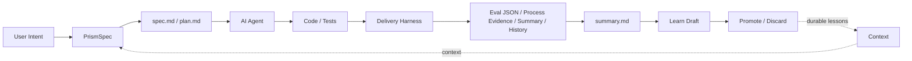

# Lattice 设计 Wiki

这组文档解释 Lattice 的系统设计、当前实现边界和后续路线。README 负责快速上手；Wiki 负责回答“为什么这样设计、现在做到哪里、下一步怎么演进”。

## 核心判断

Lattice 的技术路线是可行的，但它不是中心化 AI 平台，也不是新的 IDE。它更适合定位为安装在业务仓库内的 **AI Coding harness**：

- 在意图到代码之间，用 PrismSpec 和 Context 减少 Agent 猜测。
- 在代码到交付之间，用 Delivery gates 和 evidence 抑制 Agent 自评。
- 在单次交付之后，用 Loop 和 Learn 把可复用经验沉淀回项目上下文资产。

当前实现已经具备最小可信闭环：安装、初始化、PrismSpec 引导、目录化 spec、per-spec context、spec 状态推进与 transition history、plan/task contract lint、next task resolver、evidence-gated task completion、summary draft、summary-to-learn draft、context-lint、context-run evidence、基础 context 供给、验证 pipeline、基础 gates、结构化 eval run、central eval sink、static eval dashboard、eval query、loop state、outcome link/report、可配置 failure category、failure category lint、escalation learn draft、learn draft promotion/discard、knowledge review evidence、knowledge metadata lint、knowledge governance lint、review/TDD process evidence、Markdown summary/history 和 smoke test。尚未完成的是 dashboard 趋势增强、插件协议和多语言 drift parser。

## 系统图

## 文档导航

| 文档 | 重点 |
|------|------|
| [整体设计](overall-design.md) | Lattice 的边界、分层、数据流和可插拔点 |
| [SDD 设计](sdd.md) | PrismSpec 五阶段链路、Plan/TDD mode、产物契约 |
| [Context 设计](context.md) | Agent 上下文地图、项目知识、外部知识和 per-spec context |
| [Eval 设计](eval.md) | 当前 evidence 与未来结构化指标 |
| [Loop 设计](loop.md) | verify-fix-rerun-escalate-learn 闭环 |
| [Gap 与 Roadmap](gaps-and-roadmap.md) | 当前 gap、优先级和里程碑 |

## 设计原则

| 原则 | 含义 |
|------|------|
| Spec as contract | Spec 是人审、Agent 执行和 gate 验证之间的契约。 |
| Code remains truth | 代码、测试、schema 和运行输出仍是真相源。 |
| Context map first | 先给 Agent 明确上下文地图，再由 Agent 按需发现、筛选和压缩。 |
| External verification | 交付结论必须有外部命令和证据支撑。 |
| Kernel/data separation | `kernel/` 可升级，`manifest.yaml`、`specs/`、`context/` 是项目资产。 |
| Pluggable by contract | Agent、知识源、gate、eval、deploy 都通过文件和命令协议替换。 |

## 当前能力边界

已实现：

- `install.sh` / `init.sh` 安装初始化。
- `prismspec/skills/*/SKILL.md` canonical skills。
- `prismspec/bin/guide.sh` 阶段路由。
- `prismspec/bin/lint.sh` artifact contract 校验。
- `lattice/context/` 项目上下文资产与基础 knowledge backend。
- `lattice/kernel/delivery/pipeline.sh` 和内置 gates。
- `review-summary.json`、`tdd-evidence.json`、spec-state-lint、spec-status、spec transition events/history、plan-lint、task-next、task-complete、task-evidence-lint、summary-draft、summary-learn-draft、context-lint、context-run、loop state、outcome link/report、central eval sink、static eval dashboard、eval query、可配置 failure category、failure category lint、escalation learn draft、learn promotion event、knowledge review event、knowledge metadata lint、knowledge governance lint、eval run 数据集、Markdown summary 和 history report。
- smoke test 和 GitHub CI。

未完成：

- dashboard 趋势增强和更强语义冲突治理。
- 插件 manifest/schema/versioning。
- 多 Agent 状态、owner 和 lease 模型。

## 推荐阅读顺序

1. 先读 [整体设计](overall-design.md)，理解 Lattice 的系统边界。
2. 再读 [SDD 设计](sdd.md)，理解 PrismSpec 如何驱动一次 AI Coding。
3. 继续读 [Context 设计](context.md) 与 [Eval 设计](eval.md)，它们对应上下文边界和验证边界。
4. 最后读 [Loop 设计](loop.md) 和 [Gap 与 Roadmap](gaps-and-roadmap.md)，判断下一步建设优先级。
