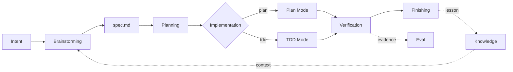

# Lattice Design Wiki

这组文档面向想理解、评估和扩展 Lattice 的读者。主 README 负责快速开始和命令参考，Wiki 负责解释系统设计、技术路线、可行性边界和后续演进。

## 一句话结论

Lattice 的技术路线是可行的：它不试图重写 AI coding agent，而是在项目仓库内增加一层可版本化的工程 harness，把需求规约、项目知识、验证卡口和失败反馈变成团队可复用资产。渐进式 SDD workflow 已抽象为独立模块 **PrismSpec**，Lattice 是 PrismSpec 的增强宿主。

当前实现已经具备最小闭环；目标流程会收敛为一条克制的 AI Coding 契约链路：

但它仍处于 scaffold + deterministic gates 阶段，真正要变成团队级框架，还需要补齐结构化状态、评估数据模型、知识治理、插件协议和更强的语言/框架适配。

## Wiki 导航

| 文档 | 说明 |
|------|------|
| [整体设计](overall-design.md) | 系统分层、核心数据流、可插拔边界和安装形态 |
| [SDD 设计](sdd.md) | PrismSpec 的 AI Coding 链路、Plan/TDD execution policy 与 Lattice-hosted 增强 |
| [知识库设计](knowledge-base.md) | Knowledge layer 的定位、索引、同步、防腐和 gap |
| [Eval 设计](eval.md) | 当前验证证据如何演进为可度量评估体系 |
| [Loop 设计](loop.md) | verify-fix-retry-learn 的闭环机制 |
| [Gap 与 Roadmap](gaps-and-roadmap.md) | 可行性评估、主要 gap、优先级和里程碑 |

## 设计原则

| 原则 | 含义 |
|------|------|
| Code remains truth | 代码、测试、schema 和运行输出仍是真相源；知识库只是检索和治理层。 |
| PrismSpec as workflow | 渐进式 SDD skills 独立成 PrismSpec；Lattice 只在项目中增强它。 |
| Spec as contract | Spec 不是说明文档，而是人审、Agent 执行和 gate 验证之间的契约。 |
| External verification | 交付结论必须由 agent 外部的命令输出支撑。 |
| Query-first context | 知识库按需求检索注入，不作为长 prompt 前缀常驻。 |
| Kernel/data separation | `kernel/` 可升级，`manifest.yaml`、`specs/`、`knowledge/` 是项目资产。 |
| Pluggable by contract | Agent、知识源、gate、eval、deploy 都通过文件和命令协议替换。 |

## 当前实现范围

已实现：

- `manifest.yaml` 作为项目级声明入口
- `prismspec/skills` 提供可独立使用的渐进式 SDD workflow
- `rules.md` / `flow.yaml` / `spec-template.md` 组成 Lattice-hosted orchestrator layer
- `loader.sh` / `sync.sh` / `knowledge/index.md` 组成 knowledge layer
- `pipeline.sh` 和多个 gate 组成 delivery layer
- AC 到测试函数的追踪检查
- Spec 结构 lint、Go/GORM/Gin 类漂移检测、合规软审计
- `init.sh`、`install.sh`、example 和 smoke test

未完全实现：

- Eval 数据集、指标模型和趋势报告
- loop 运行状态记录与自动 learn
- 多语言 drift parser
- 结构化知识元数据、置信度、来源和过期治理
- 插件 manifest/schema/versioning
- 多 agent 并发的完整协调模型

## 推荐阅读顺序

1. 先读 [整体设计](overall-design.md)，理解 Lattice 为什么是 harness 而不是 agent。
2. 再读 [SDD 设计](sdd.md)，理解 Brainstorming 如何产出持久化 Spec，以及 Plan Mode / TDD Mode 如何共享主流程。
3. 继续读 [知识库设计](knowledge-base.md) 和 [Eval 设计](eval.md)，它们对应上下文边界和验证边界。
4. 最后读 [Loop 设计](loop.md) 与 [Gap 与 Roadmap](gaps-and-roadmap.md)，判断当前实现离团队级产品还有多远。
