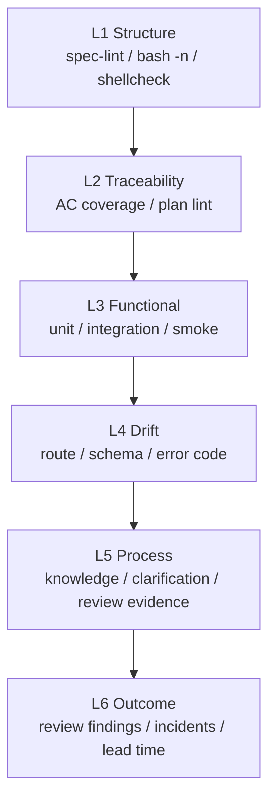

# Eval 设计

## 定位

Eval 在 Lattice 中不是“多跑几个测试”，而是回答三个问题：

1. 本次交付是否满足 Spec？
2. Agent 的工作过程是否可靠？
3. 团队的 AI Coding 质量是否在变好？

当前实现已经有 eval 原材料：spec-lint、AC coverage、drift check、compliance、build/lint/test output 和 smoke test。下一步是把这些终端证据升级为结构化 run data。

## 当前形态

| 来源 | 当前输出 | 评价内容 |
|------|----------|----------|
| `spec-lint.sh` | pass/fail | Spec 是否具备可执行结构 |
| `ac-coverage.sh` | coverage diagnostics | AC 是否有测试追踪 |
| `drift-check.sh` | drift diagnostics | Spec 与代码是否偏移 |
| `compliance.sh` | warnings | 是否引用知识、是否有澄清痕迹 |
| build/lint/test | terminal output | 工程基础质量 |
| smoke test | pass/fail summary | 框架自身是否可运行 |

这些属于 deterministic eval，优先级高于主观打分。

## 推荐分层



短期优先 L1-L4，因为它们确定性强、误报低。L5-L6 先做记录，不急着自动判定。

## 目标数据模型

建议新增：

```text
lattice/state/eval-runs/
└── <run-id>.json
```

示例：

```json
{
  "run_id": "2026-06-28T12-00-00Z",
  "project": "my-api",
  "git_sha": "abc1234",
  "spec_file": "lattice/specs/coupon-redemption/spec.md",
  "spec_hash": "sha256:...",
  "agent": "claude-code",
  "kernel_version": "0.1.0",
  "pipeline": {
    "status": "pass",
    "duration_ms": 18342,
    "retry_count": 1
  },
  "metrics": {
    "ac_total": 5,
    "ac_covered": 5,
    "drift_count": 0,
    "compliance_warnings": 1
  },
  "steps": [
    {
      "name": "ac-coverage",
      "status": "pass",
      "duration_ms": 210,
      "summary": "5/5 ACs covered"
    }
  ]
}
```

## 指标

短期指标：

| 指标 | 含义 |
|------|------|
| pipeline pass rate | 完整流水线通过率 |
| first-pass pass rate | 首次运行即通过比例 |
| AC coverage | AC 被测试追踪的比例 |
| drift count | 规约与代码漂移数量 |
| retry count | 修复轮数 |
| escalation count | 超出重试预算次数 |

中期指标：

| 指标 | 含义 |
|------|------|
| spec churn | spec 在 planned 后被修改次数 |
| knowledge hit rate | Brainstorming 阶段知识命中比例 |
| missed AC rate | review 或线上发现的漏验收比例 |
| review finding density | 每次 review 发现的问题密度 |

长期指标：

| 指标 | 含义 |
|------|------|
| defect escape rate | gate 通过后仍逃逸的问题 |
| lead time impact | 交付周期变化 |
| incident recurrence | 已知知识是否拦住重复事故 |

## 与 CI 的关系

CI 是 eval 的天然执行环境：

1. PR 触发 pipeline。
2. pipeline 产生 `eval-runs/<run-id>.json`。
3. CI 上传 artifact。
4. PR comment 展示 pass/fail、AC coverage、drift findings。
5. 后续 dashboard 读取 JSON 做趋势。

## 当前 gap

| Gap | 影响 | 下一步 |
|-----|------|--------|
| pipeline output 仍是文本 | 难做趋势和对比 | `pipeline.sh --json-out` |
| 无 run id/spec hash/git sha | 难复盘 | eval run schema |
| review verdict 未结构化 | 语义质量无法进入指标 | `review-summary.json` |
| 无 agent/kernel version | 难比较版本 | 记录 agent、model、kernel version |
| 无 CI artifact 约定 | 数据不稳定沉淀 | GitHub Actions 上传 eval JSON |

## 演进顺序

1. 为 pipeline 增加 `--json-out`。
2. 记录 run id、spec hash、git sha、kernel version。
3. 把 AC coverage 和 drift findings 写入 JSON。
4. 接入 CI artifact。
5. 再引入 review findings 和趋势报告。
