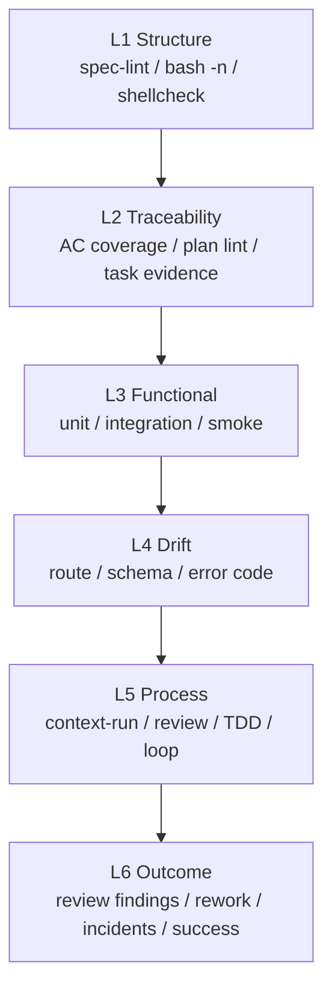

# Evidence / Eval 设计

## 定位

Lattice 的 Evidence / Eval 层不是“多跑几条测试”，也不是主观给 Agent 打分。它负责把一次 AI Coding 交付的关键证据结构化，回答三个问题：

1. 本次交付是否满足 Spec？
2. Agent 的过程是否可审查、可恢复、可追责？
3. 团队的 AI Coding 质量是否在变好？

Verification 和 Eval 的边界必须分清：

| 概念 | 作用 | 典型产物 |
|------|------|----------|
| Verification | 运行外部命令，判断本次交付是否通过。 | pipeline output、gate JSON、`verify.md` |
| Evidence / Eval | 保存、汇总和分析验证结果、过程证据和交付后 outcome。 | `eval-runs/*.json`、summary/history、outcome report、central sink、dashboard |

因此，Lattice 不把 Eval 设计成另一个测试框架，而是把测试、drift、review、TDD、context、loop 和 outcome 收敛成统一的质量观察面。

## 设计原则

| 原则 | 含义 |
|------|------|
| Command-backed first | 能由命令证明的，不用模型自评替代。 |
| Deterministic before subjective | 先做 spec lint、AC coverage、drift、test、review evidence，再考虑智能分析。 |
| Evidence is append-friendly | eval run、outcome、transition、promotion 都应能长期累积。 |
| Human-readable and machine-readable | 同一份证据同时服务 Markdown report、CI artifact、dashboard 和 Agent 查询。 |
| Outcome closes the loop | 交付后 review finding、返工、逃逸缺陷、事故和成功信号要能关联回 eval run。 |
| Attribution is a signal, not a verdict | 当前只做归因线索，不伪装成自动因果判定。 |

## Evidence 分层



短期优先 L1-L4，因为它们确定性强、误报低。L5-L6 先记录、汇总和暴露风险线索，不急着自动裁决。

## 当前证据来源

| 来源 | 输出 | 证明什么 |
|------|------|----------|
| `spec-lint.sh` | pass/fail、diagnostics | Spec 是否具备可执行结构。 |
| `ac-coverage.sh` | coverage diagnostics、gate JSON | AC 是否有测试追踪。 |
| `drift-check.sh` | drift diagnostics、gate JSON | Spec 与代码、schema、route 是否偏移。 |
| `compliance.sh` | warnings、gate JSON | 是否引用知识、是否保留澄清和合规痕迹。 |
| build/lint/test | terminal output | 工程基础质量。 |
| `review-summary.sh` | review verdict JSON | task reviewer 的 spec compliance、code quality、test coverage、risk 证据是否完整。 |
| `tdd-evidence.sh` | TDD red/green JSON | TDD task 是否有红灯、绿灯和 AC trace。 |
| `context-run.sh` | context-run JSON | 本次 spec 采用、排除和缺失了哪些 context。 |
| `pipeline.sh --json-out` | eval run JSON | 汇总 gate、process、context 和 loop evidence。 |
| `spec-status.sh` / `spec-history.sh` | transition JSON、history Markdown | spec lifecycle 是否按状态推进。 |
| `loop state` | `lattice/state/loops/*.json` | 失败步骤、retry、failure category、next action。 |
| `knowledge-review.sh` / `learn-draft.sh` | review event、promotion/discard event | learn draft 是否经过治理。 |
| `outcome-link.sh` / `outcome-report.sh` | outcome event、attribution report | 交付后真实反馈如何关联回 eval run。 |
| `eval-summary.sh` / `eval-history.sh` | Markdown summary/history | 人可读的单次结果和趋势。 |
| `eval-sink.sh` / `eval-dashboard.sh` / `eval-query.sh` | central sink、static dashboard、Markdown/JSON query | 多项目汇总和跨项目查询。 |
| smoke test | pass/fail summary | 框架自身是否可运行。 |

## 数据模型

一次 pipeline 可以写出：

```text
lattice/state/eval-runs/
├── <run-id>.json        # structured eval run
├── <run-id>.md          # human-readable summary
└── <run-id>.gates/      # per-gate JSON evidence

lattice/state/loops/
└── <run-id>.json        # retry/escalation state

lattice/state/outcomes/
└── <outcome-id>.json    # post-delivery outcome link
```

eval run 的核心字段：

| 字段 | 说明 |
|------|------|
| `run_id` | 本次验证运行 ID。 |
| `project` / `git_sha` / `kernel_version` | 可追踪运行环境。 |
| `spec_file` / `spec_hash` | 关联的 spec 与版本。 |
| `pipeline.status` | `pass`、`fail` 或 `escalation`。 |
| `steps[]` | 每个 pipeline step 的命令、状态、exit code、耗时和摘要。 |
| `gates[]` | AC coverage、drift、compliance 等结构化 gate evidence。 |
| `metrics` | AC、drift、review、TDD、context、loop 等可聚合指标。 |
| `process_evidence` | review summary、TDD evidence、context-run evidence。 |
| `loop_state` | retry、失败分类、下一步动作和 learn draft。 |

这份 JSON 是机器事实源；Markdown summary/history、CI Step Summary、dashboard 和 query 都应从它派生。

## Outcome Link

Verification 只能证明“当时的命令通过了”。团队真正关心的是：通过之后有没有 review finding、返工、逃逸缺陷、事故或成功信号。

Lattice 用 outcome link 把这些结果关联回 eval run：

```bash
bash lattice/kernel/delivery/outcome-link.sh record \
  --eval=<run-id|eval.json> \
  --type=review_finding \
  --severity=medium \
  --source=code-review \
  --summary="missing regression test" \
  --context-ref=rules.md#ac-trace
```

`outcome-report.sh` 会输出：

- outcome 类型和严重度分布；
- 被 outcome 引用最多的 context refs；
- 需要复盘的 run、spec、source、summary；
- 风险线索，例如 `negative-outcome`、`severe-outcome`、`no-context-run`、`blocking-context-gap`、`review-failed`、`review-cannot-verify`。

这些是复盘优先级线索，不是自动因果判定。

## Central Eval Sink

单项目 evidence 先落在 repo 内。需要多项目视图时，再发布到本地 central sink：

```bash
bash lattice/kernel/delivery/eval-sink.sh publish --sink-dir=lattice/state/eval-sink
```

目录形态：

```text
lattice/state/eval-sink/
├── index.md
└── projects/<project>/
    ├── manifest.json
    ├── eval-runs/
    ├── outcomes/
    └── reports/
```

它是文件协议，不是服务端平台。这样做的价值是先稳定跨项目数据布局，后续 dashboard、周报、质量巡检和外部平台都可以消费同一份 evidence。

## Dashboard 与 Query

静态 dashboard：

```bash
bash lattice/kernel/delivery/eval-dashboard.sh \
  --sink-dir=lattice/state/eval-sink \
  --out=lattice/state/eval-sink/dashboard.html
```

查询 central sink：

```bash
bash lattice/kernel/delivery/eval-query.sh summary --sink-dir=lattice/state/eval-sink
bash lattice/kernel/delivery/eval-query.sh runs --sink-dir=lattice/state/eval-sink --project=<project> --format=json
bash lattice/kernel/delivery/eval-query.sh outcomes --sink-dir=lattice/state/eval-sink --type=review_finding --format=json
```

`eval-query.sh` 保持文件协议，不启动服务端。它适合做周报、质量巡检、跨项目风险筛选，也可以作为后续 dashboard 的数据源。

## 指标

短期指标：

| 指标 | 含义 |
|------|------|
| pipeline pass rate | 完整流水线通过率。 |
| first-pass pass rate | 首次运行即通过比例。 |
| AC coverage | AC 被测试追踪的比例。 |
| drift count | 规约与代码漂移数量。 |
| retry count | 修复轮数。 |
| escalation count | 超出重试预算次数。 |
| review verdict | pass / fail / cannot_verify 分布。 |
| TDD completeness | TDD red/green evidence 完整度。 |
| context evidence | context-run 数量、selected facts、blocking gaps。 |
| outcome links | review finding、rework、escaped defect、incident、success 数量。 |

中期指标：

| 指标 | 含义 |
|------|------|
| spec churn | spec 在 planned 后被修改次数。 |
| knowledge hit rate | Brainstorming 阶段项目知识命中比例。 |
| missed AC rate | review 或线上发现的漏验收比例。 |
| review finding density | 每次 review 发现的问题密度。 |

长期指标：

| 指标 | 含义 |
|------|------|
| defect escape rate | gate 通过后仍逃逸的问题。 |
| lead time impact | AI Coding 对交付周期的影响。 |
| incident recurrence | 已知知识是否拦住重复事故。 |

## 与 CI 的关系

CI 是 Evidence / Eval 的天然执行环境：

1. PR 触发 `pipeline.sh --json-out`。
2. pipeline 产生 eval run JSON 和 gate JSON。
3. `eval-summary.sh` 生成 Markdown summary。
4. CI 写入 GitHub Step Summary，并上传 `lattice-eval-<run-id>` artifact。
5. PR 事件中，`pr-comment.sh` best-effort 创建或更新带 marker 的 Lattice comment。
6. 后续任务可用 `eval-history.sh`、`eval-sink.sh`、`eval-dashboard.sh` 和 `eval-query.sh` 做趋势、汇总和查询。

`harness-template/.github/workflows/lattice-eval.yml` 提供 GitHub Actions 模板。`init.sh --ci=github` 会安装到目标项目。PR comment 使用 `continue-on-error`，避免 fork PR 或 token 权限限制影响验证结论。

## 当前 Gap

| Gap | 影响 | 下一步 |
|-----|------|--------|
| outcome attribution 仍是线索级 | 已有 outcome report、central sink 和静态 dashboard，但还不能做因果判定。 | 先增强 report 和 query 的复盘维度。 |
| dashboard 仍是静态文件 | 已有 CLI/JSON 查询，但缺少交互过滤和跨项目趋势视图。 | 增加趋势视图与过滤能力。 |
| drift parser 覆盖有限 | 当前 Go 示例较完整，Node/Python 等栈还需要更多 parser。 | 结合真实项目逐步扩展。 |

## 演进顺序

1. 增强 dashboard 过滤和趋势视图。
2. 增加跨项目 outcome attribution 分析。
3. 扩展更多语言的 drift parser。
4. 在真实业务案例中验证指标是否真正能指导团队改进。
