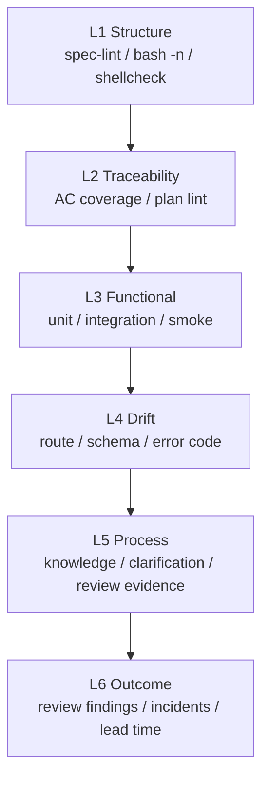

# Eval 设计

## 定位

Eval 在 Lattice 中不是“多跑几个测试”，而是回答三个问题：

1. 本次交付是否满足 Spec？
2. Agent 的工作过程是否可靠？
3. 团队的 AI Coding 质量是否在变好？

当前实现已经有 eval 原材料：spec-lint、AC coverage、drift check、compliance、build/lint/test output、context-lint、context-run、review summary、TDD red/green evidence、spec transition events/history、loop state、outcome link、outcome attribution report、central eval sink、static eval dashboard、eval query、可配置 failure category、failure category lint、escalation learn draft、knowledge review event、learn promotion event、knowledge governance lint 和 smoke test。`pipeline.sh --json-out` 会把一次运行写成结构化 eval run，并嵌入 AC coverage、drift check、compliance 的 gate JSON、当前 spec 对应的 context-run、process evidence 以及 loop state；`spec-status.sh` 会把成功的状态推进写入 `lattice/state/spec-transitions/*.json`，`spec-history.sh` 会把事件汇总成 Markdown 生命周期报告；失败时，loop state 会包含 `failure_category` 和 `default_action`，分类规则来自 `lattice/config/failure-categories.yaml`；`failure-category-lint.sh` 和 doctor 会前置检查分类配置；当 retry budget 耗尽时，它会在 `lattice/context/drafts/` 生成待确认 learn draft；确认后，`knowledge-review.sh` 会记录 approve/reject 证据，`learn-draft.sh` 会记录 promotion/discard 事件，并运行 advisory knowledge lint；交付后的 review finding、返工、逃逸缺陷、事故或成功反馈可以用 `outcome-link.sh` 关联回 eval run，并用 `outcome-report.sh` 汇总归因线索。`eval-summary.sh` 会把 eval JSON 渲染成 Markdown summary，供本地阅读和 CI Step Summary 使用；`eval-history.sh` 会把多次 eval run 和 outcome link 聚合为趋势报告；`eval-sink.sh` 可以把单项目 evidence 发布到本地 central sink；`eval-dashboard.sh` 可以从 central sink 生成无需服务端的静态 dashboard；`eval-query.sh` 可以用 Markdown/JSON 查询 central sink。

## 当前形态

| 来源 | 当前输出 | 评价内容 |
|------|----------|----------|
| `spec-lint.sh` | pass/fail | Spec 是否具备可执行结构 |
| `ac-coverage.sh` | coverage diagnostics | AC 是否有测试追踪 |
| `drift-check.sh` | drift diagnostics | Spec 与代码是否偏移 |
| `compliance.sh` | warnings | 是否引用知识、是否有澄清痕迹 |
| `review-summary.sh` | review verdict JSON | spec compliance、code quality、test coverage、risk 是否被审查 |
| `tdd-evidence.sh` | TDD red/green JSON | TDD task 是否有红灯、绿灯和 AC trace |
| `context-lint.sh` | context diagnostics | context basis 是否残留空模板、占位符或 blocking gaps |
| `context-run.sh` | context-run JSON | 本次 spec 采用了哪些 context、排除了哪些、还剩哪些 gap |
| `lattice/state/loops/*.json` | loop state JSON | retry 次数、失败步骤、失败分类、下一步动作和 escalation 状态 |
| `lattice/context/drafts/escalation-*.md` | learn draft | retry 耗尽后的待确认经验候选 |
| `lattice/state/knowledge-reviews/*.json` | knowledge review event | 经验候选 approve/reject、reviewer、reason 和 conflict check |
| `lattice/state/learn-promotions/*.json` | learn promotion event | 经验候选被晋升或废弃的审计记录 |
| `lattice/state/outcomes/*.json` | outcome link event | 交付后真实结果与 eval run 的关联 |
| `outcome-report.sh` | attribution Markdown | outcome 类型、严重度、context refs 和风险线索 |
| `eval-sink.sh` | central sink files | 将 eval/outcome/report 发布到多项目汇总目录 |
| `eval-dashboard.sh` | static HTML | central sink 项目、eval/outcome/report 和最近 outcome 概览 |
| `eval-query.sh` | Markdown / JSON | central sink summary、runs、outcomes 的过滤查询 |
| `knowledge-lint.sh` | governance diagnostics | source、placeholder、conflict marker、expiry、duplicate heading 检查 |
| `eval-history.sh` | history Markdown | 多次运行的 pass rate、AC coverage、review/TDD/outcome 趋势 |
| build/lint/test | terminal output | 工程基础质量 |
| smoke test | pass/fail summary | 框架自身是否可运行 |

这些属于 deterministic eval，优先级高于主观打分。

## 推荐分层



短期优先 L1-L4，因为它们确定性强、误报低。L5-L6 先做记录，不急着自动判定。

## 当前数据模型

Pipeline 可写出：

```text
lattice/state/eval-runs/
├── <run-id>.json
└── <run-id>.md
lattice/state/outcomes/
└── <outcome-id>.json
lattice/state/eval-sink/
├── index.md
└── projects/<project>/
    ├── manifest.json
    ├── eval-runs/
    ├── outcomes/
    └── reports/
```

示例：

```json
{
  "run_id": "2026-06-28T12-00-00Z",
  "project": "my-api",
  "git_sha": "abc1234",
  "spec_file": "lattice/specs/coupon-redemption/spec.md",
  "spec_hash": "sha256:...",
  "agent": "claude-code",
  "kernel_version": "0.1.0",
  "pipeline": {
    "status": "pass",
    "duration_ms": 18342,
    "retry_count": 1
  },
  "metrics": {
    "ac_total": 5,
    "ac_covered": 5,
    "drift_count": 0,
    "compliance_warnings": 1,
    "review_total": 1,
    "review_failed": 0,
    "review_cannot_verify": 0,
    "tdd_total": 1,
    "tdd_complete": 1,
    "loop_retry_count": 1,
    "loop_retry_max": 3,
    "loop_escalated": false
  },
  "loop_state": {
    "kind": "loop-state",
    "status": "pass",
    "next_action": "done",
    "retry_count": 1,
    "retry_max": 3,
    "failed_step": "",
    "failure_category": "",
    "default_action": "",
    "learn_draft": ""
  },
  "steps": [
    {
      "name": "ac-coverage",
      "status": "pass",
      "duration_ms": 210,
      "summary": "5/5 ACs covered"
    }
  ],
  "gates": [
    {
      "gate": "ac-coverage",
      "status": "pass",
      "metrics": {
        "ac_total": 5,
        "ac_covered": 5
      },
      "findings": []
    }
  ],
  "process_evidence": {
    "review_summaries": [
      {
        "kind": "review-summary",
        "verdict": "pass",
        "axes": {
          "spec_compliance": "pass",
          "code_quality": "pass",
          "test_coverage": "pass",
          "risk": "pass"
        }
      }
    ],
    "tdd_evidence": [
      {
        "kind": "tdd-evidence",
        "status": "pass",
        "ac_ids": ["AC-1"]
      }
    ]
  }
}
```

交付后的真实结果可以通过 outcome link 记录：

```bash
bash lattice/kernel/delivery/outcome-link.sh record \
  --eval=<run-id|eval.json> \
  --type=review_finding \
  --severity=medium \
  --source=code-review \
  --summary="missing regression test" \
  --context-ref=rules.md#ac-trace
```

输出事件包含：

```json
{
  "schema_version": "lattice.outcome-link.v1",
  "kind": "outcome-link",
  "eval_run": {
    "run_id": "20260628T195355Z-5665",
    "spec_file": "lattice/specs/create-item-api/spec.md",
    "git_sha": "abc1234",
    "pipeline_status": "pass"
  },
  "outcome": {
    "type": "review_finding",
    "severity": "medium",
    "source": "code-review",
    "summary": "missing regression test"
  },
  "context_refs": ["rules.md#ac-trace"],
  "eval_metrics": {
    "context_run_total": 1,
    "context_selected_facts": 5,
    "context_blocking_gaps": 0
  }
}
```

归因线索报告：

```bash
bash lattice/kernel/delivery/outcome-report.sh --out=lattice/state/outcome-report.md
```

它会输出：

- outcome 类型和严重度分布；
- 被 outcome 引用最多的 context refs；
- 需要复盘的 run、spec、source、summary；
- 风险线索，例如 `negative-outcome`、`severe-outcome`、`no-context-run`、`blocking-context-gap`、`review-failed`、`review-cannot-verify`。

这不是因果判定，只是把“哪些 evidence 值得复盘”排到前面。

发布到 central eval sink：

```bash
bash lattice/kernel/delivery/eval-sink.sh publish --sink-dir=lattice/state/eval-sink
```

它会把当前项目的 eval JSON、outcome JSON 和 Markdown reports 复制到 `projects/<project>/`，并生成：

- `projects/<project>/manifest.json`：项目名、git sha、发布时间、eval/outcome/report 数量；
- `index.md`：多项目概览表。

当前 sink 是文件协议，不是服务端平台。它的价值是先稳定跨项目数据布局，静态 dashboard 和后续交互查询都可以消费同一份目录。

生成静态 dashboard：

```bash
bash lattice/kernel/delivery/eval-dashboard.sh --sink-dir=lattice/state/eval-sink --out=lattice/state/eval-sink/dashboard.html
```

dashboard 直接消费 central sink 文件，输出一个可本地打开的 HTML。它适合试点阶段展示项目数、eval runs、outcomes、reports 和最近 outcome；它不是交互式平台，也不替代 CI artifact、Markdown report 或后续结构化查询。

查询 central eval sink：

```bash
bash lattice/kernel/delivery/eval-query.sh summary --sink-dir=lattice/state/eval-sink
bash lattice/kernel/delivery/eval-query.sh runs --sink-dir=lattice/state/eval-sink --project=<project> --format=json
bash lattice/kernel/delivery/eval-query.sh outcomes --sink-dir=lattice/state/eval-sink --type=review_finding --format=json
```

`eval-query.sh` 是 dashboard 之前的更底层能力：它保留文件协议，不启动服务端，输出可以被人阅读的 Markdown，也可以输出 Agent/CI 易消费的 JSON。适合做周报、质量巡检、跨项目风险筛选和后续 dashboard 数据源。

## 指标

短期指标：

| 指标 | 含义 |
|------|------|
| pipeline pass rate | 完整流水线通过率 |
| first-pass pass rate | 首次运行即通过比例 |
| AC coverage | AC 被测试追踪的比例 |
| drift count | 规约与代码漂移数量 |
| retry count | 修复轮数 |
| escalation count | 超出重试预算次数 |
| review verdict | pass / fail / cannot_verify 分布 |
| TDD completeness | TDD red/green evidence 完整度 |
| outcome links | review finding、rework、escaped defect、incident、success 数量 |

中期指标：

| 指标 | 含义 |
|------|------|
| spec churn | spec 在 planned 后被修改次数 |
| knowledge hit rate | Brainstorming 阶段知识命中比例 |
| missed AC rate | review 或线上发现的漏验收比例 |
| review finding density | 每次 review 发现的问题密度 |

长期指标：

| 指标 | 含义 |
|------|------|
| defect escape rate | gate 通过后仍逃逸的问题 |
| lead time impact | 交付周期变化 |
| incident recurrence | 已知知识是否拦住重复事故 |

## 与 CI 的关系

CI 是 eval 的天然执行环境：

1. PR 触发 pipeline。
2. pipeline 产生 `lattice/state/eval-runs/<run-id>.json` 和 gate JSON。
3. `eval-summary.sh` 产生 `lattice/state/eval-runs/<run-id>.md`。
4. CI 写入 GitHub Step Summary，并上传 `lattice-eval-<run-id>` artifact。
5. PR 事件中，`pr-comment.sh` best-effort 创建或更新一条带 marker 的 Lattice comment。
6. 本地或后续任务可用 `eval-history.sh` 聚合 `lattice/state/eval-runs/*.json`。
7. `eval-sink.sh publish` 可把 evidence 发布到 central sink。
8. `eval-dashboard.sh` 可复用同一份 Markdown/JSON 展示项目、eval、report 和 outcome signals。

Lattice 在 `harness-template/.github/workflows/lattice-eval.yml` 提供 GitHub Actions 模板。`init.sh --ci=github` 会安装到目标项目的 `.github/workflows/lattice-eval.yml`。该 workflow 的约定是：先运行 `pipeline.sh --json-out`，再生成 Markdown summary，写入 Step Summary、上传 eval artifact，并在 PR 上 best-effort 发布 comment；最后再按 pipeline exit code 决定 CI 是否失败。PR comment 使用 `continue-on-error`，避免 fork PR 或 token 权限限制影响验证结论。

## 当前 gap

| Gap | 影响 | 下一步 |
|-----|------|--------|
| outcome attribution 仍是线索级 | 已有 outcome report、central sink 和静态 dashboard，但还不能做因果判定 | analysis |
| dashboard 仍是静态文件 | 已有 CLI/JSON 查询，但缺少交互过滤和跨项目趋势视图 | dashboard trend |

## 演进顺序

1. 增强 dashboard 过滤和趋势视图。
2. 增加跨项目 outcome attribution 分析。
3. 扩展更多语言的 drift parser。
