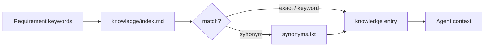

# 知识库设计

## 定位

Lattice 的知识库是项目级 context retrieval layer，不是代码真相源，也不是企业知识平台。

它解决的问题是：很多影响 AI Coding 正确性的约束不在当前文件里，例如业务不变量、历史事故、命名规范、接口约定和团队决策。

核心原则：

- 代码、测试、schema 和运行输出仍是真相源。
- 知识库只存跨需求会复用的规则和经验。
- 需求阶段按关键词检索，不把全量知识塞进 prompt。
- 每条知识都应该有来源、适用范围和更新时间。

## 当前结构

```text
lattice/knowledge/
├── index.md
├── synonyms.txt
└── <slug>.md

lattice/kernel/knowledge/
├── loader.sh
├── sync.sh
└── README.md
```

`index.md` 是检索入口：

```markdown
- `payment-idempotency` | keywords: payment, idempotency, fund | 支付写操作必须有幂等键
```

知识条目承载规则：

```markdown
# Payment Idempotency

**Keywords**: payment, idempotency, fund
**Core rule**: All payment mutations require an idempotency key.
**Source**: 2026-06 incident review
**Context**: ...
```

## 检索流程



当前实现适合几十到几百条项目规则：零服务依赖、离线可用、容易审计。它暂时不是向量 RAG，也不做复杂 ranking。

## 应该存什么

| 类型 | 示例 | 建议 |
|------|------|------|
| 业务不变量 | 订单状态只能单向流转 | 推荐 |
| 接口契约 | 错误码、鉴权、幂等要求 | 推荐 |
| 命名规范 | API camelCase、DB snake_case | 推荐 |
| 架构决策 | 为什么不用某个缓存或队列方案 | 推荐 |
| 事故教训 | 某接口不能批量重放 | 推荐 |
| 临时讨论 | 未确认会议结论 | 谨慎 |
| 大段源码 | 从代码复制几百行 | 不推荐 |
| 通用 prompt 技巧 | 与项目无关的使用经验 | 不推荐 |

## 防腐设计

知识库最大的风险不是“不够多”，而是过期后仍被 Agent 信任。

建议演进到 front matter schema：

```yaml
---
id: payment-idempotency
title: Payment idempotency rules
keywords: [payment, idempotency, fund]
source_type: incident
source_ref: docs/incidents/2026-06-payment-dup.md
owner: platform-team
created_at: 2026-06-26
updated_at: 2026-06-26
expires_at: 2026-12-31
confidence: verified
truth_scope: payment-service
---
```

关键字段：

| 字段 | 作用 |
|------|------|
| `source_ref` | 支撑来源，避免口口相传 |
| `owner` | 过期或冲突时找谁确认 |
| `expires_at` | 防止临时规则永久化 |
| `confidence` | 区分 draft / verified / deprecated |
| `truth_scope` | 限定适用系统或模块 |

## 与 PrismSpec 的关系

Knowledge 主要在 Brainstorming 阶段影响：

- Scope：哪些边界不能碰；
- AC：哪些验收标准必须显式化；
- Risk：哪些历史坑必须规避；
- Execution Policy：是否需要 TDD。

Implementation 阶段也可以读取知识，但不应把知识库当作代码索引。函数级实现细节应该从代码和测试读取。

## 当前 gap

| Gap | 影响 | 下一步 |
|-----|------|--------|
| 无结构化 metadata | 难治理来源和过期 | knowledge front matter schema |
| 无 stale/conflict 检测 | 旧知识可能误导 Agent | `knowledge-lint.sh` |
| loader 无 ranking | 命中质量不稳定 | exact / synonym / tag / fuzzy 分层 |
| learn 仍是约定 | 失败经验沉淀不稳定 | escalation 生成 learn draft |
| 无使用记录 | 不知道一次 spec 用了哪些知识 | 写入 eval run |

## 推荐演进

1. 为知识条目增加 front matter schema。
2. 增加 `knowledge-lint.sh`，检查 source、owner、expires、confidence。
3. 让 `loader.sh` 输出 matched entries 到 `verify.md` 或 eval JSON。
4. 在 retry escalation 后生成 learn draft。
5. 支持 central knowledge repo 的 read-only sync。
