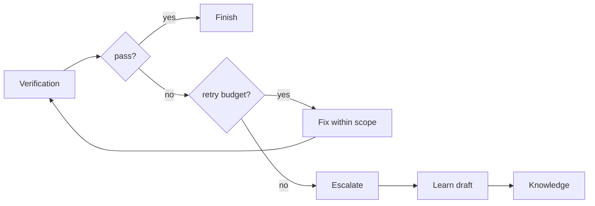
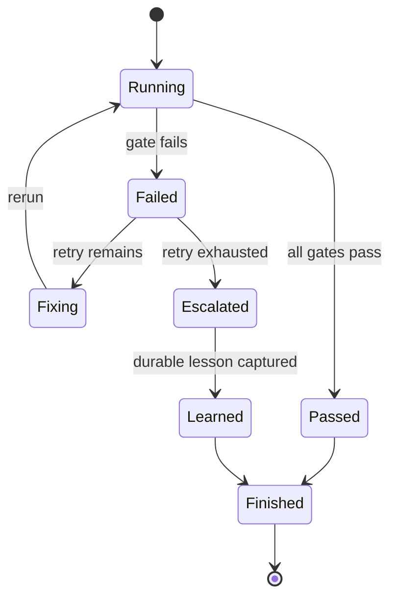

# Loop 设计

## 定位

Loop 是 Lattice 从失败到修复、重跑、升级和知识沉淀的闭环。



Loop 的目标不是让 Agent 无限自修复，而是让失败可控：

- 能自动修复的，限制在 spec scope 内重跑；
- 超出预算或需要决策的，及时升级；
- 可复用教训进入 knowledge draft；
- 下一次同类问题更早在 spec 或 gate 阶段被拦住。

## 当前实现

`pipeline.sh` 已具备最小 loop 基础：

- 读取 retry count / retry max；
- 某一步失败后停止；
- 重试耗尽后 exit `2`；
- 输出 escalation 诊断。

当前缺失：

- retry 状态没有独立落盘；
- 失败分类不结构化；
- escalation 不会自动生成 learn draft；
- loop 与 eval run 尚未打通。

## 状态模型

推荐状态：



目标状态文件：

```text
lattice/state/loops/<run-id>.json
```

示例：

```json
{
  "run_id": "2026-06-28T12-00-00Z",
  "spec_file": "lattice/specs/coupon-redemption/spec.md",
  "git_sha": "abc1234",
  "status": "failed",
  "retry_count": 2,
  "retry_max": 3,
  "last_failed_step": "drift-check",
  "failure_category": "route_drift",
  "failure_summary": "POST /coupons/redeem exists in spec but not in router",
  "next_action": "fix_code"
}
```

## 失败分类

| 类别 | 示例 | 默认动作 |
|------|------|----------|
| environment | 缺 yq、docker 未启动 | 提示安装或跳过不可用 gate |
| spec_structure | 缺 AC、缺风险说明 | 修 spec |
| implementation | build/lint/test 失败 | 修代码 |
| ac_gap | AC 没有测试追踪 | 补测试或调整 spec |
| drift | route/schema/error code 不一致 | 修代码或更新 spec |
| compliance | 未引用知识、无澄清记录 | 补证据或人工确认 |
| unknown | 无法判断 | escalation |

分类可以先从 gate name + regex 做起，不需要一开始引入复杂模型。

## Learn 回路

当 retry 耗尽或人工确认出现可复用教训时，生成 learn draft：

```text
lattice/state/learn-drafts/<run-id>.md
```

draft 内容：

```markdown
# Draft: route drift in coupon redemption

**Failure category**: drift
**Failed step**: drift-check
**Spec**: lattice/specs/coupon-redemption/spec.md
**Lesson candidate**: New API specs must update router registration and route tests together.
**Evidence**: eval-runs/<run-id>.json
```

进入正式 knowledge 前必须人工或 reviewer 确认，避免把一次性实现细节污染知识库。

## 与 PrismSpec 的关系

Loop 不新增 SDD 阶段，它嵌入 Verification：

- Verification 失败且可修：回到 Implementation。
- Verification 失败且不可修：Escalation。
- Escalation 产生 learn draft。
- Finishing 记录最终状态和残留风险。

## 当前 gap

| Gap | 影响 | 下一步 |
|-----|------|--------|
| retry 状态不落盘 | 难复盘 | `lattice/state/loops/*.json` |
| 失败无分类 | 难自动处理 | failure category schema |
| learn draft 未自动生成 | 经验沉淀不稳定 | escalation hook |
| 与 eval 未打通 | 指标不完整 | loop state 写入 eval run |

## 演进顺序

1. 在 pipeline 中记录 loop state JSON。
2. 基于 gate name + regex 做失败分类。
3. retry exhausted 时生成 learn draft。
4. Finishing 引用 loop state 和 learn draft。
5. 将 loop metrics 汇总到 eval run。
