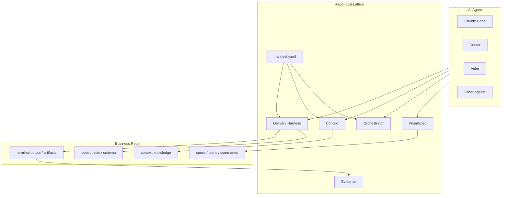
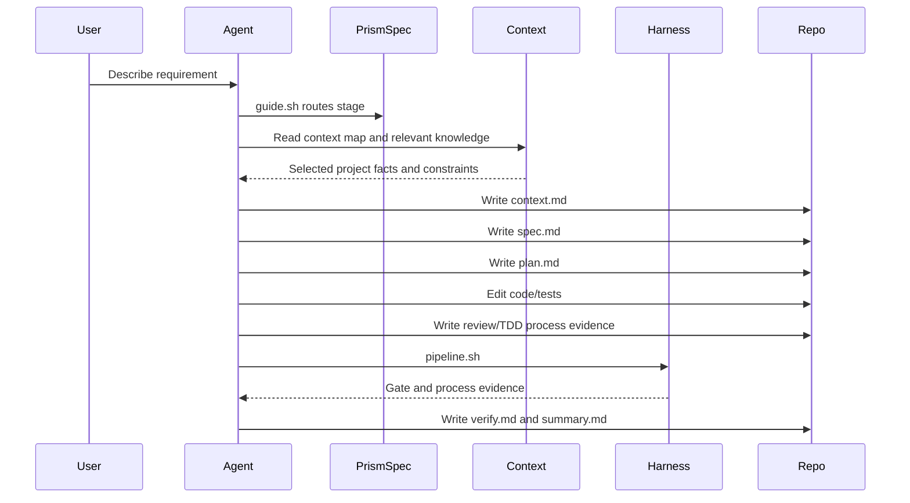

# 整体设计

## 定位

Lattice 是项目级 AI Coding harness。它安装到业务仓库中，通过文件、YAML 和 shell 命令给现有 Agent 增加工程约束。

它不拥有：

- IDE 或编辑器；
- 模型运行时；
- 云端调度平台；
- CI/CD 和生产发布系统。

它负责：

- 让需求进入持久化 Spec；
- 让 Agent 在项目上下文约束下工作；
- 让交付声明经过外部验证；
- 让失败和经验能回到项目 context。

## 系统边界

## 分层

| 层 | 职责 | 当前形态 |
|----|------|----------|
| PrismSpec | 独立 Spec Coding workflow | `prismspec/skills/*/SKILL.md`、`guide.sh`、`lint.sh` |
| Orchestrator | Agent 规则、阶段定义、模板入口 | `lattice/kernel/orchestrator/` |
| Context | 给 Agent 提供项目上下文地图、项目知识、外部知识入口，并沉淀 per-spec context | `lattice/context/`、`lattice/kernel/context/` |
| Delivery | 运行可复现验证卡口 | `lattice/kernel/delivery/` |
| Eval | 从 gate output、loop state 与 process evidence 提炼质量证据 | `pipeline --json-out` 生成 eval run，收集 loop/review/TDD JSON，`eval-summary.sh` 生成 summary，`eval-history.sh` 生成趋势报告 |

## 数据流

## 可插拔点

| 插件点 | 方式 | 示例 |
|--------|------|------|
| Agent adapter | 导入规则，执行 shell 命令 | Claude Code、Cursor、Aider、Superpowers |
| Spec template | `manifest.yaml` 指定模板路径 | service、frontend、tdd templates |
| Context source | Agent-readable context map，必要时辅以 sync 脚本 | repo-local、central context、external docs |
| Delivery gate | `pipeline.steps[]` command | build、lint、test、drift、compliance |
| Drift parser | `drift.plugins[]` command | route/schema/error-code parser |
| Eval sink | `pipeline --json-out` + process evidence + `eval-summary.sh` / `eval-history.sh` + GitHub Actions artifact/comment | local JSON、Markdown summary/history、CI Step Summary、PR comment、dashboard |

## 为什么不是中心化平台

Lattice 当前选择 repo-local 形态，因为它的核心资产本来就在项目仓库里：

- Spec、plan、summary 需要跟代码一起 review。
- Context 与业务规则强绑定，需要版本化。
- Gate 应该复用项目自己的 build/test/lint 命令。
- 团队可以逐步采用，不需要先迁移 IDE 或工作流平台。

中心化平台可以作为后续 eval dashboard 或 central knowledge 的形态出现，但不应该成为第一性依赖。

## 当前判断

这条路线成立，但要保持边界克制：

- Lattice 不做 Agent runtime。
- PrismSpec 不做重型项目管理。
- Context 不做大而全 RAG 平台，也不追求把所有资料塞进 prompt。
- Eval 不过早承诺智能评分，先把可复现证据结构化。

真正的产品化重点是：稳定安装、清晰文档、真实示例、可靠 gates、可审计 evidence。
