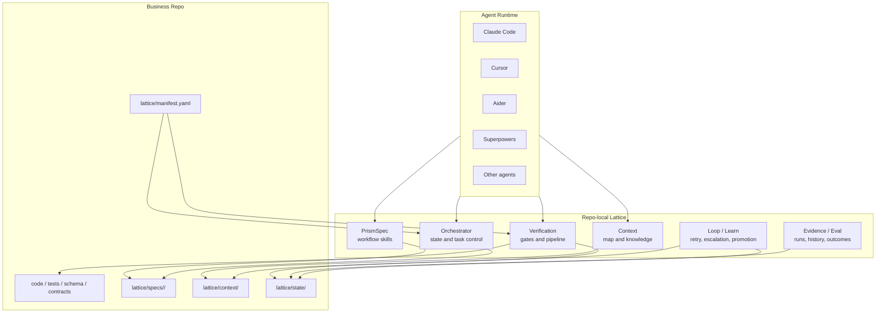
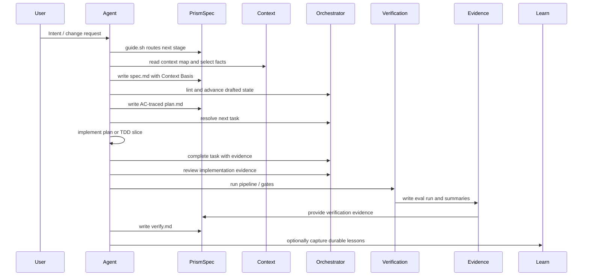

# 整体设计

## 定位

Lattice 是安装在业务仓库里的 repo-local AI Coding harness。它不替代 Claude Code、Cursor、Aider、Superpowers 或其他 Agent，而是给这些执行器补上团队交付需要的项目契约：

- **Spec contract**：需求、上下文、AC、计划和收尾证据落到可版本化文件。
- **Context contract**：Agent 先读项目上下文地图，再选择本次 spec 需要的最小可信依据。
- **Verification contract**：完成声明必须由外部命令、gates 和结构化 evidence 支撑。
- **Learning contract**：失败、复盘和可复用经验先进入 draft，再经 review 晋升为项目知识。

一句话：Lattice 不做新的 Agent runtime，它把 AI Coding 从个人工作流提升为可审查、可验证、可沉淀的团队工程系统。

## 系统边界



边界要保持清楚：

| 不做 | 原因 |
|------|------|
| 不做 IDE / 编辑器 | 现有 Agent 和 IDE 已经承担交互与执行体验。 |
| 不做模型运行时 | Lattice 只定义项目契约，不绑定模型供应商。 |
| 不做中心化任务平台 | 第一性资产在业务仓库：代码、spec、context、evidence。 |
| 不做大而全 RAG | Context 的目标是更准，不是更多。 |
| 不做主观智能打分 | 先沉淀可复现 evidence，再逐步做趋势和归因。 |

## 组件模型

| 组件 | 专业定义 | 关键产物 | 当前实现 |
|------|----------|----------|----------|
| PrismSpec | Spec Coding skill pack，负责把 intent 推进到 durable artifacts | `spec.md`、`plan.md`、debugging/review evidence、`verify.md` | `prismspec/skills/`、`prismspec/bin/new.sh`、`prismspec/bin/doctor.sh`、`prismspec/bin/guide.sh`、`prismspec/bin/lint.sh`、`prismspec/bin/eval-skills.sh`、`prismspec/templates/` |
| Orchestrator | Agent 控制面，负责阶段路由、状态推进、任务选择和 evidence gating | spec status、transition events、task evidence | `lattice/kernel/orchestrator/`、`spec-status.sh`、`task-next.sh`、`task-complete.sh`、`plan-lint.sh` |
| Context | 项目上下文供给层，负责让 Agent 精准找到本次决策依据，并写入 `spec.md` Context Basis | context map、project knowledge、external map、selected facts | `lattice/context/`、`lattice/kernel/context/` |
| Verification | 可复现验证面，负责运行 build/lint/test/drift/compliance 等 gates | gate output、pipeline result | `lattice/kernel/delivery/pipeline.sh`、`gates/` |
| Evidence / Eval | 证据与质量观测层，负责把验证和过程记录结构化，供本地、CI、dashboard 和复盘使用 | eval run、summary、history、outcome report、central sink | `eval-summary.sh`、`eval-history.sh`、`eval-sink.sh`、`eval-dashboard.sh`、`eval-query.sh`、`outcome-link.sh` |
| Loop / Learn | 反馈闭环，负责失败分类、有限重试、升级、learn draft 和知识晋升 | loop state、escalation draft、knowledge review、promotion event | `failure-categories.yaml`、`learn-draft.sh`、`knowledge-review.sh`、`summary-learn-draft.sh` |

### Verification 和 Eval 的关系

两者不重复：

- **Verification** 是动作：运行命令，判断本次交付是否通过。
- **Evidence / Eval** 是记录与分析：保存验证结果、过程证据、历史趋势和交付后 outcome。

因此 Lattice 不把 Eval 设计成“另一个测试系统”，而是把测试、drift、review、TDD、loop、outcome 等证据收敛成统一的质量观察面。

## 生命周期



用户视图保持为五个产品板块：

```text
Clarify -> Spec -> Build -> Review -> Verify
```

内部 PrismSpec stage 仍保持克制：

```text
Intent -> Specification -> Planning -> Implementation(plan|tdd) -> Review -> Verification
```

`/prismspec` 只是引导入口，不新增阶段。Clarify 和 Spec 目前共用 `prismspec-specification`，Build 组合 Planning、Implementation 和 Debugging。Loop / Learn 不新增主流程，只在 Verification 后通过 `/capture` 可选触发。

## 产物边界

安装后的业务项目应形成三类文件：

| 类型 | 路径 | 所有权 | 说明 |
|------|------|--------|------|
| Framework code | `lattice/kernel/`、`prismspec/` | Lattice 可升级 | 命令、gates、skills、模板和脚本。 |
| Project assets | `lattice/manifest.yaml`、`lattice/context/`、`lattice/specs/` | 项目所有 | 团队要 review、版本化和长期维护。 |
| Runtime state | `.lattice/sdd/`、`lattice/state/` | 运行生成 | evidence、eval runs、loop state、outcome、promotion events。 |

最核心的 spec 目录是：

```text
lattice/specs/<spec-id>/
├── spec.md        # intent、scope、Context Basis、AC、risk、mode、verification plan
├── plan.md        # AC-traced implementation tasks
├── review.md      # read-only review verdicts, findings, and dispositions
└── verify.md      # 命令、验证结果、残留风险、知识候选
```

## 可插拔点

Lattice 的扩展面是文件、YAML 和命令 contract，而不是绑定某个 Agent SDK。

| 插件点 | Contract | 示例 |
|--------|----------|------|
| Agent adapter | 导入 `AGENTS.md` / `CLAUDE.md` / skill instructions | Claude Code、Cursor、Aider、Superpowers |
| Spec template | `prismspec/templates/*.md`，可由项目覆盖 | service、frontend、lite、tdd |
| Context source | Agent-readable Markdown map，必要时补结构化 sources | project knowledge、central knowledge、external contracts |
| Delivery gate | `pipeline.steps[]` command | build、lint、test、AC coverage、drift、compliance |
| Drift parser | gate 或 parser command 输出 diagnostics | routes、schema、error codes |
| Evidence sink | eval JSON + markdown report + optional central sink | local state、CI artifact、static dashboard、PR comment |
| Learn governance | draft + review event + promotion/discard event | pitfalls、rules、architecture decisions |

## 设计取舍

| 取舍 | 选择 | 理由 |
|------|------|------|
| repo-local vs central platform | 先 repo-local | adoption 成本低，能跟代码一起 review，适合渐进式落地。 |
| Markdown vs database | 先 Markdown + JSON evidence | 人和 Agent 都能读，git diff 友好，必要时再汇总到 central sink。 |
| Shell vs full SDK | Shell 用于可复现命令 contract | 安装、验证、CI、轻量 lint 适合 shell；语义判断交给 Agent。 |
| Plan vs TDD | 同一流程，两种 implementation policy | 不为低风险任务增加 TDD 成本，但高风险任务必须有红绿灯证据。 |
| Context retrieval | Agentic discovery 为主，工具检索为辅 | 模型负责理解和选择，项目负责给地图、规则和可审查记录。 |

## 专业化方向

当前路线成立，但产品化重点不是继续堆脚本，而是把每一层做成稳定 contract：

1. **入口可信**：README、Wiki、AGENTS、SKILL 入口描述一致，不出现旧路径和过期概念。
2. **流程可恢复**：`guide.sh`、status、task-next、task-complete 能让下一位 Agent 从文件恢复上下文。
3. **验证可审计**：pipeline、gate JSON、eval summary/history 能证明“为什么算完成”。
4. **知识可治理**：Context 不追求全量加载，Learn 不把一次性经验污染长期知识。
5. **示例够真实**：用 Lumi 等真实业务案例验证复杂 spec、context、loop 和 learn 是否跑得通。

这也是 Lattice 对标 Superpowers 和 agent-skills 时的清晰边界：Superpowers 更偏工作流技能和 TDD 方法，agent-skills 更偏高质量可复用 skill 包；Lattice 应该把 PrismSpec skills 与 repo-local harness 结合起来，形成团队级交付闭环。
