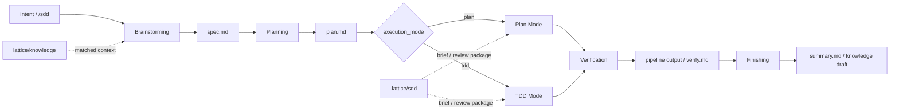

# PrismSpec / SDD 设计

## 设计结论

PrismSpec 是从 Lattice 中独立出来的渐进式 SDD（Spec-Driven Development）skills 模块。它不是一套重型审批流程，也不是单纯的 `spec.md` 模板。它的专业边界是：

> 用最小必要上下文，把需求转成可执行契约；用计划约束执行路径；用测试、review package 和 delivery gates 证明结果；只把可复用知识沉淀到 knowledge。

Lattice 是 PrismSpec 的增强宿主：如果项目安装了 Lattice，PrismSpec 会使用 `lattice/manifest.yaml`、`lattice/specs/`、knowledge loader、delivery pipeline 和 eval gates；如果没有 Lattice，PrismSpec 仍可独立使用 `prismspec/specs/` 和本地 build/lint/test 命令完成主流程。

核心链路保持克制：

```text
Intent
  -> Brainstorming
  -> Planning
  -> Implementation(plan | tdd)
  -> Verification
  -> Finishing
```

用户入口可以是阶段命令，也可以是 `/sdd`。`/sdd` 不是第六个阶段，而是一个引导 controller：定位 spec、判断当前产物状态，然后委托给对应阶段 skill。在 Lattice-hosted 模式下，它额外读取 `manifest.yaml` 获取路径、mode、knowledge 和 verification 配置。

这五步不是五层审批，而是五个控制点：

| 阶段 | 回答的问题 | 持久产物 |
|------|------------|----------|
| Brainstorming | 要解决什么，什么算做对？ | `spec.md` |
| Planning | 怎么拆成可执行、可审查的任务？ | `plan.md` |
| Implementation | 按 plan 低摩擦执行，还是用 TDD 钉住行为？ | code / tests / task evidence |
| Verification | 结果是否被独立证据证明？ | `verify.md` / pipeline output，后续可结构化为 eval JSON |
| Finishing | 哪些证据和知识需要留下？ | `summary.md` / knowledge draft |

多一个阶段就多一次人工损耗。因此 Lattice 不单独设置 `/spec-review`、`/spec-freeze`、`/spec-trace`。这些能力分别收敛到 Brainstorming 出口标准、front matter 状态、Verification gate 和 Finishing evidence 中。

## 重要设计：Spec 模板可覆盖

Spec 模板不是写死在 PrismSpec 里的。独立使用时默认读取 `prismspec/templates/spec-template.md`；Lattice-hosted 时，项目可以通过 `lattice/manifest.yaml` 覆盖：

```yaml
specs:
  active: ""  # optional: spec id or path
  template: "lattice/kernel/orchestrator/templates/spec-template.md"
  default_execution_mode: "auto"   # auto | plan | tdd
  allow_execution_mode_override: true
```

默认模板参考 Superpowers 的工程纪律，也吸收 Lattice 的 Spec Coding 判断：Spec 不是越厚越好，而是把 Intent 到 Code 之间必须显式化的约束沉淀下来。

默认模板只保留八类信息：

| Section | 作用 |
|---------|------|
| Intent | 锁定问题和目标 |
| Scope | 锁定做什么、不做什么 |
| Context | 放最小必要约束，不复制知识库 |
| Acceptance Criteria | 定义什么算做对 |
| Design Decisions | 只记录需要人审的单向门 |
| Risk Notes | 暴露资金、安全、权限、状态、并发、幂等等风险 |
| Execution Policy | 记录 `plan` / `tdd` 的选择和来源 |
| Verification Plan | 明确如何证明完成 |

团队可以替换模板，但不建议删除这八类语义。前端、配置、活动模板、后端核心链路可以用不同模板；共同要求是：能让人 review，能让 Agent 执行，能让 gate 验证。

## 设计原则

### 1. 最小上下文发现，不做全量上下文加载

Brainstorming 需要上下文，但不应该变成“全量读项目”的重阶段。上下文加载遵循三条规则：

| 规则 | 含义 |
|------|------|
| 影响 Scope / AC / Risk / Execution Policy 的，必须加载 | 例如接口兼容、状态机、资金安全、权限边界、历史事故 |
| 只影响具体实现细节的，留到 Planning 或 Implementation | 例如局部函数写法、内部 helper 选择 |
| 不确定是否影响验收的，向用户澄清，不猜 | 避免把实现假设写进 spec |

因此，Brainstorming 的输入不是固定全量清单，而是按需发现：

| 输入 | 用途 | 读取边界 |
|------|------|----------|
| 用户原始需求 | 识别 Intent、Scope、AC | 必读 |
| `lattice/manifest.yaml` | 找到 spec/knowledge/verification 配置、项目语言、gate 入口 | 只读与本次 SDD 流程相关的配置 |
| 相关代码、测试、schema、接口契约入口 | 判断已有能力、兼容边界、验收可行性 | 只看与需求直接相关的入口，不进入函数级实现 |
| `lattice/knowledge/` 命中条目 | 注入领域规则、历史决策、踩坑记录 | 基于关键词和代码入口检索，只引用影响 Scope/AC/Risk/Policy 的条目 |

这也是为什么 Brainstorming 需要 `manifest.yaml`：它是项目级路由表，不是业务上下文本身。Agent 通过它知道 spec 放哪里、knowledge 怎么检索、verification 怎么运行。它不应该把整个 manifest 当作需求上下文粘进 spec。

### 2. Spec 是执行契约，不是厚文档

Spec 的价值不在篇幅，而在于服务三类读者：

| 读者 | 关注点 |
|------|--------|
| Human reviewer | 意图、边界、关键决策、验收标准是否合理 |
| Agent | 约束空间、不能猜的规则、可执行验收 |
| Gate | 结构、AC 覆盖、风险和漂移检测是否有基线 |

Spec 是本次变更的执行基线，不是永久 truth。代码、测试、schema 和运行输出仍是真相源；长期有效的业务规则从 Spec 中提取到 knowledge。

### 3. Plan Mode 和 TDD Mode 是 execution policy，不是两套 workflow

两种模式共享同一条主流程：

```text
Brainstorming -> Planning -> Implementation -> Verification -> Finishing
```

区别只在 Implementation 和 Verification 的约束强度：

| 模式 | 适用场景 | 关键约束 | Verification 要求 |
|------|----------|----------|-------------------|
| Plan Mode | 常规功能、简单 CRUD、低风险改动、已有测试覆盖较好 | `plan.md` 控制执行路径 | build/lint/test 通过，必要验收有证据 |
| TDD Mode | bug fix、核心链路、资金/权限/状态机、并发/幂等、历史回归点 | red test 控制行为边界 | AC coverage 必须通过，red/green 证据必须可追溯 |

一句话：Plan Mode 用计划约束路径；TDD Mode 用失败测试约束行为。

### Mode 选择策略

`execution_mode` 默认由模型按风险智能选择，但受项目配置和用户单次指令约束：

| 优先级 | 来源 | 规则 |
|--------|------|------|
| 1 | 用户单次指定 | 本次 spec 使用用户指定的 `plan` 或 `tdd`，并记录 `Source: user-override` |
| 2 | 项目默认配置 | `specs.default_execution_mode: plan | tdd` 时使用项目默认，记录 `Source: project-default` |
| 3 | 模型选择 | `default_execution_mode: auto` 时由模型根据风险选择，记录 `Source: model-selected` |

模型选择原则：

- 默认走 `plan`：低风险、局部改动、配置变更、简单 CRUD、已有测试覆盖较好。
- 必须走 `tdd`：bug fix、核心业务链路、资金/安全/权限/状态机、并发/幂等、异常补偿、历史回归点。
- 可以从 `plan` 升级到 `tdd`：Planning 或 Implementation 发现风险高于预期时，先更新 `spec.md` / `plan.md` 再继续。
- 不应静默从 `tdd` 降级到 `plan`：除非用户明确覆盖，并记录原因。

### 4. Review 是证据契约，不是额外流程

参考 Superpowers 6.0 的核心改进，Lattice 不把 review 做成独立阶段，而是在 Implementation/Finishing 中生成和消费 review evidence：

| 能力 | Lattice 做法 |
|------|--------------|
| File-backed context | `task-brief.sh` 生成简洁任务 brief，避免粘贴大段上下文 |
| Read-only diff review | `review-package.sh` 生成只读 diff package |
| Dual verdict | reviewer 分别判断 spec compliance 和 code quality |
| `cannot-verify` | diff/evidence 不足时允许明确说不能验证，而不是猜 |

注意这里有两个不同概念：

- Spec authoring review：Brainstorming 的出口检查，不独立成 `/spec-review`。
- Implementation diff review：Implementation/Finishing 的 evidence contract，通过 review package 承载。

## 命名与文件布局

### Artifact 分类

Lattice 区分三类文件：

| 类别 | 路径 | 是否进 Git | 作用 |
|------|------|------------|------|
| Durable contract | `lattice/specs/<spec-id>/` | 是 | 本次变更的可审查契约 |
| Transient evidence | `.lattice/sdd/<spec-id>/<task-id>/` | 否 | 执行期 brief、diff package、临时证据 |
| Reusable knowledge | `lattice/knowledge/` | 是 | 跨需求复用的领域规则和经验 |

推荐布局：

```text
lattice/specs/<spec-id>/
├── spec.md
├── plan.md
├── verify.md      # optional; current implementation primarily emits pipeline output
└── summary.md

.lattice/sdd/<spec-id>/<task-id>/
├── brief.md
├── review-package.md
├── implementation-notes.md      # optional
└── review.md                    # optional reviewer output
```

### 命名规则

命名要稳定、可读、可引用，避免把文件名绑死在某个临时工单或日期上。

| 对象 | 规则 | 示例 | 反例 |
|------|------|------|------|
| `spec-id` | kebab-case，描述业务能力或行为变化 | `coupon-redemption`, `order-refund-idempotency` | `task-123`, `new-api`, `20260627-fix` |
| durable files | 固定语义文件名 | `spec.md`, `plan.md`, `summary.md` | `coupon-redemption-spec-v2.md` |
| task id | 计划内稳定编号 | `T1`, `T2`, `T3` | `task-a`, `fix-handler-first` |
| red-test task | TDD 专用编号 | `RED-1`, `RED-2` | `test-1`, `fail-case` |
| AC id | spec 内稳定验收编号 | `AC-1`, `AC-2` | `A1`, `case-one` |

为什么 durable files 使用固定名称：

- 一次需求的上下文集中在一个目录，review 成本低。
- Agent 可以稳定定位 `spec.md` 和 `plan.md`，不用猜文件名。
- 后续可对整个 `<spec-id>` 目录做 hash、状态检查和 evidence 汇总。

为什么 transient evidence 放 `.lattice/sdd/`：

- 它是运行时上下文，不是长期契约。
- 可以被 `.gitignore` 忽略，避免把大 diff package 或临时 reviewer 输出提交到仓库。
- 避免写入 `.git/`，兼容更严格的 agent/harness 安全策略。

## 主流程



`/sdd` 的恢复规则很简单：

| 当前产物 | 下一步 |
|----------|--------|
| 没有 `spec.md` | Brainstorming |
| 有 `spec.md`，没有 `plan.md` | Planning |
| 有 `plan.md`，任务未完成 | Implementation |
| 任务完成但缺验证证据 | Verification |
| 验证通过但缺 `summary.md` | Finishing |
| `summary.md` 已存在 | 报告状态和可选后续动作 |

## 阶段 1：Brainstorming

### 目标

Brainstorming 负责需求澄清、最小上下文发现和约束收敛。它不是泛泛讨论，也不是提前写实现方案；它的唯一 durable output 是 `spec.md`。

### 动作

1. 识别 Intent：要解决什么问题，为什么现在要做。
2. 做最小上下文发现：
   - 读取 manifest 中与 spec、knowledge、verification 相关的配置。
   - 检查与需求直接相关的代码、测试、schema、接口契约入口。
   - 检索 knowledge 中命中的领域规则、历史决策、踩坑记录。
3. 澄清只会影响 Scope、AC、Risk、Execution Policy 的问题。
4. 收敛 Scope、Acceptance Criteria、Design Decisions、Risk Notes。
5. 选择 `execution_mode: plan | tdd`。
6. 写入 `lattice/specs/<spec-id>/spec.md`。

### `spec.md` 结构

```markdown
---
id: <spec-id>
status: drafted
execution_mode: plan | tdd
owner: <owner>
created_at: <timestamp>
updated_at: <timestamp>
---

# Spec: <title>

## Intent

One sentence: what problem this change solves and why it matters.

## Scope

### In

- ...

### Out

- ...

## Context

| Source | Constraint | Why it matters |
|--------|------------|----------------|
| manifest / code / knowledge | | |

## Acceptance Criteria

| # | When | Then | Verification |
|---|------|------|--------------|
| AC-1 | | | |

## Design Decisions

| # | Decision | Rationale | Reversible? |
|---|----------|-----------|-------------|
| D-1 | | | yes / no |

## Risk Notes

| Risk | Mitigation | Verification |
|------|------------|--------------|
| | | |

## Execution Policy

- Mode: plan | tdd
- Reason:
- Source: model-selected | project-default | user-override

## Verification Plan

| Gate / Test | Required? | Notes |
|-------------|-----------|-------|
| spec-lint | yes | |
| build | yes | |
| lint | yes | |
| unit-test | yes | |
```

### 出口标准

进入 Planning 前，`spec.md` 必须满足：

- Intent 清楚。
- Scope 有明确 In/Out。
- AC 可验证，并且编号稳定。
- Context 只包含本次任务需要的少量约束。
- Design Decisions 只记录需要人审的单向门。
- Risk Notes 覆盖 money/security/permission/state/concurrency/idempotency/regression 等高风险点。
- Execution Policy 已明确，并说明为什么是 `plan` 或 `tdd`。

## 阶段 2：Planning

### 目标

Planning 把 `spec.md` 拆成 implementer 和 reviewer 都能消费的执行契约。它不是项目计划书，也不是实现细节大全。

### 动作

1. 读取 `spec.md` 和相关代码入口。
2. 提取 `Global Constraints`：只写会跨 task 传播、且遗漏会导致错误实现的约束。
3. 拆分 task：每个 task 足够小，可以独立实现、测试和 review。
4. 为每个 task 标注 Scope/AC 引用。
5. 为每个 task 声明 Interfaces：输入、输出、触碰文件/契约、验证方式。
6. TDD Mode 下补 `Test-first Tasks`。
7. 写入 `lattice/specs/<spec-id>/plan.md`。

### `plan.md` 结构

```markdown
# Plan: <title>

## Source

- Spec: `lattice/specs/<spec-id>/spec.md`
- Execution mode: plan | tdd

## Global Constraints

- Versions / dependencies:
- Naming / style:
- Security / permissions:
- Data / migration:
- Compatibility:
- Out-of-scope:

## Tasks

- [ ] T1: <task>
  - Ref: AC-1, AC-2
  - Interfaces:
    - Inputs:
    - Outputs:
    - Touched files/contracts:
  - Files:
  - Verification:
  - Evidence:
    - Brief: `.lattice/sdd/<spec-id>/T1/brief.md`
    - Review package: `.lattice/sdd/<spec-id>/T1/review-package.md`

## Test-first Tasks

<!-- Required when execution_mode is tdd -->

- [ ] RED-1: Add failing test for AC-1
  - Expected failure:
  - Test file:
```

### 出口标准

- 每个 task 引用 Scope 或 AC。
- `Global Constraints` 不复制 README、manifest 或通用 coding style，只保留跨 task 必须携带的约束。
- 每个 task 都声明 Interfaces 和 Verification。
- task 粒度适合 review，不把大范围重构和业务行为混在一起。
- TDD Mode 下明确 red-test-first 任务。

## 阶段 3：Implementation

Implementation 是唯一有分支的阶段。分支不是流程级别，而是执行策略。

### Plan Mode

适用场景：常规功能、低风险变更、已有测试覆盖较好的路径。

流程：

```text
plan.md -> task brief -> code changes -> necessary tests -> review package
```

规则：

- 按 `plan.md` 顺序执行。
- 每个 task 开始前生成 task brief：

```bash
bash lattice/kernel/orchestrator/sdd/task-brief.sh <spec-id> <task-id>
```

- 每个 task 完成后生成 review package：

```bash
bash lattice/kernel/orchestrator/sdd/review-package.sh <spec-id> <task-id>
```

- 行为变化必须补必要测试。
- 如果发现 spec drift，停止实现，回到 Brainstorming 或 Planning 修正。

### TDD Mode

适用场景：bug fix、核心链路、资金/权限/状态机、并发/幂等、历史回归点。

流程：

```text
plan.md -> task brief -> red tests -> code changes -> green tests -> refactor -> review package
```

硬规则：

- 没有 red test，不开始实现。
- red test 必须追踪 AC。
- 不能通过删除、跳过、放宽测试换绿。
- refactor 后测试仍必须保持 green。
- red/green 证据写入 task notes、review package 或后续结构化 evidence。

测试命名建议：

```go
func TestAC1_CreateItem(t *testing.T) {}
```

```python
def test_ac1_create_item():
    ...
```

```typescript
describe("AC-1: create item", () => {})
```

### Review Package Contract

review package 是只读 diff evidence，不是新阶段：

```text
.lattice/sdd/<spec-id>/<task-id>/review-package.md
```

reviewer 或 subagent 只读取 package，不修改工作区。输出两个 verdict：

```markdown
## Verdict

- Spec compliance: pass | fail | cannot-verify
- Code quality: pass | fail | cannot-verify
```

`cannot-verify` 的处理规则：

| 类型 | 处理 |
|------|------|
| 涉及 AC、security、data consistency、permission、TDD red/green | 不能标记 completed；必须补证据/补测试/重审，或 escalated |
| 非阻塞 code quality 或可接受的环境限制 | 可在 Finishing 中作为 residual risk 明示 |

## 阶段 4：Verification

### 目标

Verification 用独立 gate 验证结果，不接受 Agent 自评。

### 当前实现

当前 Lattice 已实现的是 pipeline output：

```bash
bash lattice/kernel/delivery/pipeline.sh
```

推荐 gate：

```text
spec-lint
build
lint
unit-test
ac-coverage
integration-test / smoke
drift-check
compliance
```

Plan Mode 和 TDD Mode 要求不同：

| Gate | Plan Mode | TDD Mode |
|------|-----------|----------|
| spec-lint | 必须 | 必须 |
| build/lint/test | 必须 | 必须 |
| ac-coverage | 按风险启用 | 必须 |
| drift-check | 有 API/schema/error-code 变更时必须 | 有 API/schema/error-code 变更时必须 |
| compliance | 软 gate | 软 gate，可 strict |

### 目标产物

`verify.md` 和 eval JSON 是下一步结构化方向，不应误读为当前已完整自动生成：

```text
lattice/specs/<spec-id>/verify.md
lattice/state/eval-runs/<run-id>.json
```

未来 `verify.md` 可采用：

```markdown
# Verify: <title>

## Run

- Spec: `lattice/specs/<spec-id>/spec.md`
- Plan: `lattice/specs/<spec-id>/plan.md`
- Commit: <sha>
- Mode: plan | tdd

## Results

| Gate | Result | Evidence |
|------|--------|----------|
| spec-lint | PASS | ... |
| unit-test | PASS | ... |
| ac-coverage | PASS | AC-1/AC-2 covered |

## Decision

PASS / FAIL / ESCALATED
```

### 出口标准

- 所有必需 gate 通过。
- 失败时进入有限 retry。
- 超过 retry budget 后 escalation，不继续自修复。
- TDD Mode 下 red/green 和 AC coverage 有可追溯证据。

## 阶段 5：Finishing

### 目标

Finishing 收口交付，不制造长期文档债。它只做三件事：

1. 记录最终状态。
2. 关联 verification 和 review evidence。
3. 提取长期知识。

### `summary.md` 结构

```markdown
# Summary: <title>

## Status

completed | partial | reverted | escalated

## Evidence

- Spec:
- Plan:
- Verify:
- Task briefs:
- Review packages:
- Review verdicts:
  - Spec compliance: pass | fail | cannot-verify
  - Code quality: pass | fail | cannot-verify
- Commit:

## Changes

- ...

## Deferred / Follow-up

- ...

## Knowledge Candidates

- ...
```

### 状态判定

| 状态 | 条件 |
|------|------|
| `completed` | 必需 gate 通过；blocking review verdict 均为 pass；无未说明风险 |
| `partial` | 部分目标完成，剩余范围明确 deferred |
| `reverted` | 变更回滚，保留失败证据和教训 |
| `escalated` | retry 耗尽、blocking `cannot-verify`、或需要人工决策 |

### 知识沉淀规则

沉淀到 knowledge：

- 业务铁律。
- 事故经验。
- 高频坑。
- 跨需求复用的领域约束。
- 不可逆设计决策。
- 团队约定。

不沉淀：

- 一次性 plan。
- 和代码重复的描述。
- 临时实现细节。
- 已由测试稳定表达的普通行为。
- 未验证假设。

## Skills 设计

PrismSpec skills 保持小集合：一个引导入口，加五个阶段 skill。`/sdd` 只负责编排和恢复，不复制阶段逻辑。Lattice 安装时会把 PrismSpec 复制到 `prismspec/skills/`，并保留 `lattice/skills/` 作为 Lattice-hosted 兼容入口。

| Skill | 阶段 | 产物 |
|-------|------|------|
| `/sdd` | Controller | 解析 spec / mode / next stage，委托阶段 skill |
| `/brainstorm` | Brainstorming | `spec.md` |
| `/plan` | Planning | `plan.md` |
| `/implement` | Implementation | code / tests / `.prismspec/runs/...` 或 `.lattice/sdd/...` |
| `/verify` | Verification | `verify.md` / pipeline output / eval JSON |
| `/finish` | Finishing | `summary.md` / knowledge draft |

不建议增加独立 `/spec-review`、`/spec-freeze`、`/spec-trace`：

| 不独立成阶段 | 收敛位置 |
|--------------|----------|
| spec authoring review | Brainstorming 出口标准 |
| spec freeze | front matter 状态与后续 spec hash |
| trace | Verification 的 `ac-coverage` |
| implementation review | Implementation review package + Finishing verdict |
| update | 失败或 drift 时回到 Brainstorming/Planning |

## 状态模型

`spec.md` 使用最小 front matter：

```yaml
---
id: create-item-api
status: drafted | planned | implemented | verified | finished | escalated
execution_mode: plan | tdd
owner: dolphin
created_at: 2026-06-26T12:00:00+08:00
updated_at: 2026-06-26T12:30:00+08:00
spec_hash: sha256:...
---
```

状态推进：

```text
drafted -> planned -> implemented -> verified -> finished
                         \-> escalated
```

状态只服务追踪和 gate，不引入复杂 workflow engine。

## 当前实现边界

当前 PrismSpec 已经具备“可执行契约”的核心路径：模板可覆盖、mode 可配置、Plan/TDD 可切换、task brief / review package 可生成；Lattice-hosted 模式进一步提供 delivery pipeline、knowledge、AC coverage 和 drift gates。剩下的问题不是流程缺失，而是 enforcement 还不够机器化。

| 能力 | 当前状态 | 下一步 |
|------|----------|--------|
| Spec template | `specs.template` 已支持项目覆盖 | init 时校验模板存在；`spec-lint` 校验模板必需语义 |
| Execution mode | 支持 `auto | plan | tdd`、项目默认、用户单次覆盖 | `spec-lint` 校验 mode、mode source、plan->tdd 升级记录 |
| Plan contract | `plan.md` 已要求 `Global Constraints`、task `Interfaces`、AC/Scope 引用 | 增加 `plan-lint.sh`，把格式和追踪关系变成 gate |
| Task evidence | 独立模式使用 `.prismspec/runs/...`，Lattice-hosted 使用 `.lattice/sdd/...` | 增加结构化 `review.json` / `evidence.json` |
| Verification | 已有 pipeline、spec-lint、AC coverage、drift check | 增加 `verify.md` writer 和 eval JSON，支持趋势与回放 |
| TDD enforcement | skill 已规定 red-first，AC coverage 可验证测试命名 | 记录 red/green 命令和结果，形成可检查 evidence |

## 演进优先级

1. 强化 `spec-lint`：校验 front matter、`execution_mode`、mode source、必需语义和模板路径。
2. 新增 `plan-lint.sh`：校验 `Global Constraints`、task `Interfaces`、AC/Scope 引用、TDD red-test tasks。
3. 结构化 evidence：把 review verdict、red/green、pipeline run 写成 JSON。
4. 补 `verify.md` writer：把 pipeline output 收敛成可读交付证据。

## 总结

PrismSpec 的专业定位是“可执行契约链路”，不是流程平台。它参考 Superpowers 的阶段语义和 6.0 的证据化改进，但保持独立、轻量、可渐进采用。Lattice 则负责项目资产、知识库、命名规范和 gate。Brainstorming 做最小上下文发现，Planning 生成可审查执行契约，Implementation 生成任务证据，Verification 用外部证据证明结果，Finishing 只保留证据和长期知识。
