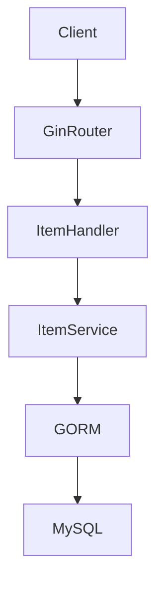
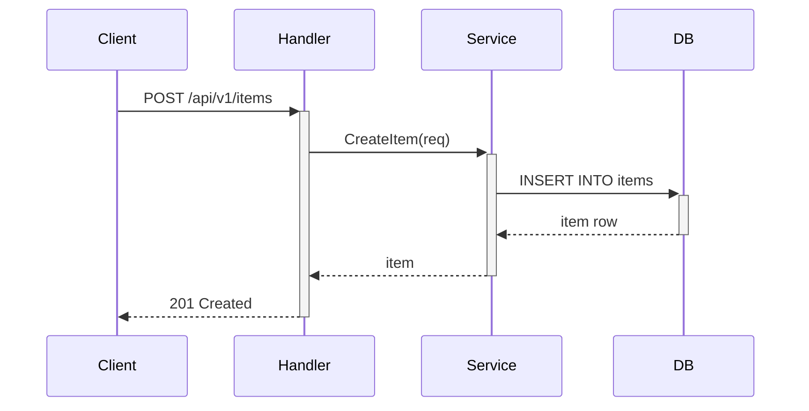

# Create Item API

## Part I — Background & Goals

### 1.1 Background & Goals

Build a CRUD API for managing items in the crane game inventory system.

### 1.2 Naming Conventions

| Layer | Style | Example |
|-------|-------|---------|
| API JSON fields | camelCase | `itemId`, `itemName` |
| Go struct fields | PascalCase | `ItemID`, `ItemName` |
| DB columns | snake_case | `item_id`, `item_name` |

---

## Part II — Technical Design

### 2.1 Technical Design

**Tech stack:** Go 1.22 / Gin / GORM / MySQL





### 2.2 API Design

| API | Method | Path | Description | Auth |
|-----|--------|------|-------------|------|
| API-1 | POST | /api/v1/items | Create item | No |
| API-2 | GET | /api/v1/items/:id | Get item by ID | No |
| API-3 | GET | /api/v1/items | List items | No |
| API-4 | DELETE | /api/v1/items/:id | Delete item | No |

### 2.3 Data Model

```sql
CREATE TABLE `items` (
  `id` bigint NOT NULL AUTO_INCREMENT,
  `name` varchar(100) NOT NULL,
  `rarity` int NOT NULL DEFAULT 1,
  `price` int NOT NULL DEFAULT 0,
  `created_at` datetime NOT NULL DEFAULT CURRENT_TIMESTAMP,
  `updated_at` datetime NOT NULL DEFAULT CURRENT_TIMESTAMP ON UPDATE CURRENT_TIMESTAMP,
  PRIMARY KEY (`id`),
  KEY `idx_rarity` (`rarity`)
) ENGINE=InnoDB DEFAULT CHARSET=utf8mb4;
```

### 2.4 Design Alternatives

Go + Gin + GORM — standard stack, no trade-offs needed at this scale.

---

## Part III — Quality Assurance

### 3.1 Acceptance Criteria

#### Happy path

Given the API server is running

| # | When | Then | Ref step |
|---|------|------|----------|
| AC-1 | POST /api/v1/items with valid body | Returns 201 with created item | ① |
| AC-2 | GET /api/v1/items/:id with valid ID | Returns 200 with item | ② |

#### Validation

Given the API server is running

| # | Condition | Then | code |
|---|-----------|------|------|
| AC-3 | GET /api/v1/items/:id with non-existent ID | Returns 404 | 404 |

#### Deletion

Given the item exists

| # | When | Then | Ref step |
|---|------|------|----------|
| AC-4 | DELETE /api/v1/items/:id | Returns 204, item no longer retrievable | ③ |

### 3.2 Risk Review

| Category | Review Item | Status | Design Basis |
|----------|-------------|--------|-------------|
| **Financial Safety** | N/A | ✅ | No financial operations |
| **Technical Risk** | Rate limiting | ✅ | Standard Gin middleware |
| **Data Risk** | Tenant isolation | ✅ | Single tenant system |
| **Release Process** | Rollback capable | ✅ | Stateless API, DB migration reversible |

### 3.3 Test Strategy

- **Unit tests**: Handler layer, covering AC-1 through AC-4
- **Integration tests**: Full DB round-trip (future)

---

## Part IV — Release

### 4.1 Release Checklist

| # | Action | Owner | Notes |
|---|--------|-------|-------|
| 1 | Run DDL migration | DBA | Create `items` table |
| 2 | Deploy API | Dev | Standard k8s deploy |

### 4.2 Rollout & Rollback

Single deploy, rollback by revert + DROP TABLE.

---

## Decision Log

| # | Decision | Impact | Default | Status |
|---|----------|--------|---------|--------|
| D-1 | Use auto-increment ID | Low | Auto-increment | ✅ |
| D-2 | No soft delete | Low | Hard delete | ✅ |
