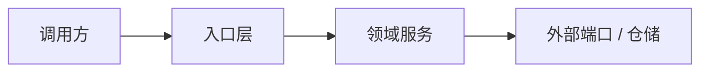
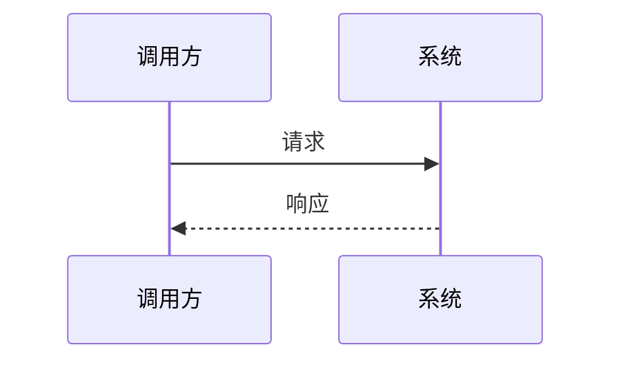

# 技术方案：{标题}

## 1. 技术目标

用工程语言描述本次要改变的系统能力，不写市场化价值主张，不把实现步骤写在这里。

| 项 | 内容 |
|---|---|
| 目标能力 | {系统完成后具备什么能力} |
| 关键约束 | {一致性、性能、权限、兼容性、成本、时限等硬约束} |
| 成功信号 | {可观测、可验证的成功结果} |
| 风险等级 | low / medium / high |
| 执行模式 | `plan` / `tdd` |

## 2. 设计范围

### 2.1 本期范围

| 模块 / 边界 | 本期交付 |
|---|---|
| {模块} | {明确交付内容} |

### 2.2 非本期范围

- {明确不做的能力}

## 3. 上下文依据

只记录会影响架构、接口、数据、一致性、验收或风险的事实；不要粘贴长文档。

| 来源 | 已采用事实或约束 | 对方案的影响 |
|---|---|---|
| 用户输入 | {事实} | {影响} |
| 代码 / 测试 | {事实} | {影响} |
| 项目知识 | {事实或 N/A} | {影响} |
| 待确认 | {问题或 None} | {影响} |

## 4. 架构设计

### 4.1 组件边界

| 组件 | 责任 | 不允许承担的责任 |
|---|---|---|
| {组件} | {职责} | {边界} |

### 4.2 核心流程

## 5. 接口契约

| 契约 | 内容 |
|---|---|
| 调用方式 | {HTTP / RPC / CLI / Job / Event / N/A} |
| 请求 | {关键字段、校验规则} |
| 成功响应 | {状态码、返回结构、可观测状态} |
| 失败响应 | {错误码、是否重试、是否有副作用} |
| 兼容性 | backward-compatible / breaking / N/A |

### 5.1 错误码

| 错误码 | 触发条件 | 副作用 | 是否可重试 |
|---|---|---|---|
| {ERROR_CODE} | {条件} | {有 / 无} | yes / no |

## 6. 数据与一致性设计

### 6.1 领域对象

| 对象 | 关键字段 | 说明 |
|---|---|---|
| {对象} | `{field}` | {语义} |

### 6.2 约束与索引

| 约束 | 目的 |
|---|---|
| {唯一性 / 状态 / 数值约束} | {为什么必须存在} |

### 6.3 一致性策略

| 场景 | 策略 |
|---|---|
| 并发写 | {锁 / CAS / 事务 / 原子端口 / N/A} |
| 幂等 | {幂等键和重复请求行为} |
| 失败补偿 | {回滚、补偿任务、待恢复记录} |
| 数据迁移 | {迁移和回滚策略或 N/A} |

## 7. 核心不变量

| 编号 | 不变量 | 验证方式 |
|---|---|---|
| INV-1 | {任何时候都必须成立的系统约束} | {测试 / gate / 审计} |

## 8. 关键设计决策

| 编号 | 决策 | 原因 | 状态 |
|---|---|---|---|
| D-1 | {技术选择} | {约束和取舍} | 待确认 / 已确认 |

## 9. 验收标准

每条验收标准必须绑定自动化测试、命令、gate 或明确人工检查点。

| 编号 | 前置条件 | 操作 | 期望结果 | 验证方式 |
|---|---|---|---|---|
| AC-1 | {Given} | {When} | {Then} | `TestAC1...` / command / gate |

## 10. 风险与降级

| 风险 | 影响 | 缓解方案 | 验证 |
|---|---|---|---|
| {风险} | {影响} | {方案} | {AC / gate} |

## 11. 边界约束

| 层级 | 约束 |
|---|---|
| 必须遵守 | {无需再问，必须遵守的工程规则} |
| 需要确认 | {高影响动作，需要用户确认} |
| 禁止事项 | {绝不能做的行为} |

## 12. 执行策略

- 执行模式：`plan` / `tdd`
- 选择原因：{为什么选择该模式}
- 升级条件：{何时从 plan 升级到 tdd，或何时拆分任务}

## 13. 验证计划

| 验证项 | 是否必需 | 证据 |
|---|---:|---|
| 构建 | yes / no | {命令或 gate} |
| 静态检查 | yes / no | {命令或 gate} |
| 单元测试 | yes / no | {测试范围} |
| 集成测试 | yes / conditional / no | {环境和证据} |
| 验收覆盖 | yes | {AC 覆盖率要求} |
| 漂移检查 | yes / no | {接口、数据、错误码、文档一致性} |
| 完成门禁 | yes | Completion Gate |

## 14. 审批状态

| 项 | 内容 |
|---|---|
| 状态 | explicit / inferred / skipped-with-reason |
| 来源 | {用户消息 / 项目默认 / 其他} |
| 结论 | ready for planning / needs clarification / blocked |

## 15. 待确认问题

- [ ] {只保留会影响架构、接口、数据、一致性、验收或执行策略的问题}
