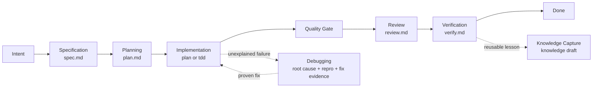

# PrismSpec

> English version: [README.en.md](README.en.md)

PrismSpec 是一套风险自适应的 Spec Coding 工作流，也是一组可独立使用、可被 Lattice 托管的 Agent Skills。它用最小必要契约，把模糊意图压缩成可执行、可审查、可验证的工程约束，并在实现阶段支持 `plan` 与 `tdd` 两种 mode。

PrismSpec 不替代 Coding Agent，也不主张一套流程打天下。它只负责把一次 AI Coding 任务落到可恢复的产物链：`spec.md`、`plan.md`、`review.md`、`verify.md`。

## 核心判断

AI Coding 的主要风险通常不是“不会写代码”，而是需求、上下文、风险判断、验证和经验都停留在对话里。PrismSpec 的设计目标是把这些关键状态移出聊天窗口，并按任务风险选择刚好足够的执行强度。

| 设计取舍 | PrismSpec 的选择 |
|----------|------------------|
| 最小必要契约 | 只保留会产生 durable artifact 或降低真实风险的阶段 |
| 风险自适应 | 低风险走 `plan`，高风险走 `tdd`；发现风险允许 `plan -> tdd` 升级 |
| 证据优先 | 每个完成声明都必须能追溯到文件、命令或 review evidence |
| 不造轮子 | Workflow discipline 优先对齐 Superpowers；skill packaging 对齐 Agent Skills |
| 可恢复 | 任意时刻都从文件状态路由，而不是依赖对话记忆 |

一句话：**PrismSpec 追求的不是更多文档，而是刚好足够强的工程契约。**

## 流程

`/prismspec` 是 controller，不是阶段。它读取当前产物，决定下一步应该调用哪个 stage skill。



## 产物地图

| 阶段 | 关键问题 | 主要产物 | 质量门禁 |
|------|----------|----------|----------|
| Specification | 做什么？依据是什么？如何验收？ | `spec.md` | Context Basis 清晰、AC 可测试、risk/mode 明确 |
| Planning | 谁按什么顺序改哪里？如何证明？ | `plan.md` | AC-traced tasks、文件边界、命令与预期结果 |
| Implementation | 如何执行一个最小切片？是否需要红灯测试？ | code、tests、task evidence | 一次一个 planned slice；TDD 需 red/green evidence |
| Quality Gate | 是否符合 spec、质量是否可接受、当前仓库是否被真实命令证明？ | `review.md`、`verify.md` | 先 review，阻塞项清零后再 verification |
| Review | 是否符合 spec？代码质量是否可接受？ | `review.md` | spec compliance 与 code quality 分离判断 |
| Verification | 当前仓库真实证明了什么？ | `verify.md` | fresh command evidence；失败先定位根因 |
| Debugging | 失败的根因是什么？ | repro、root cause、fix evidence | 先复现和验证假设，再修复 |
| Knowledge Capture | 哪些经验可复用？ | knowledge draft / project knowledge | durable、sourced、non-secret、reviewable |

## 运行模式

| 模式 | 适合场景 | 产物位置 | 依赖 |
|------|----------|----------|------|
| Standalone | 只需要 Spec Coding skills | `prismspec/specs/<id>/`、`.prismspec/runs/<id>/` | 无 |
| Lattice-hosted | 需要团队级 harness、context、gates、eval | `lattice/specs/<id>/`、`.lattice/sdd/<id>/` | Lattice |

PrismSpec 不依赖 Lattice。Lattice 内置 PrismSpec，并补充 manifest、项目 context、verification gates、AC coverage、drift check、Evidence / Eval、Loop / Learn。

PrismSpec 的人读主产物只有 `spec.md`、`plan.md`、`review.md` 和 `verify.md`。`review-summary.json`、`review-package.md`、task brief、TDD/debug evidence 和 eval run JSON 是机器侧证据或任务侧证据，不应被包装成新的用户阶段。

## Skill Pack 结构

```text
prismspec/
├── skillpack.yaml
├── skills/
│   ├── prismspec-workflow/
│   ├── prismspec-specification/
│   ├── prismspec-planning/
│   ├── prismspec-implementation/
│   ├── prismspec-review/
│   ├── prismspec-verification/
│   ├── prismspec-debugging/
│   ├── prismspec-knowledge-capture/
│   ├── prismspec-context-engineering/
│   ├── prismspec-source-grounding/
│   ├── prismspec-doubt-review/
│   └── prismspec-interface-design/
├── templates/
├── references/
├── agents/
├── commands/
└── bin/
```

每个 skill 目录都遵循 Agent Skills 包装习惯：

```text
prismspec-<skill>/
├── SKILL.md              # canonical instruction
├── agents/openai.yaml    # UI / marketplace metadata
└── evals/evals.json      # trigger and behavior evals
```

`skillpack.yaml` 是机器可读分发契约。Agent、安装器或 wrapper 应优先读取它，而不是从 README 猜目录。

## 使用方式

```bash
# 检查 skill pack 健康度
bash prismspec/bin/doctor.sh

# 创建初始 spec
bash prismspec/bin/new.sh checkout-flow --title="Checkout Flow" --template=service --mode=plan

# 从当前文件状态路由下一步
bash prismspec/bin/guide.sh --spec=checkout-flow --json

# 检查 skill 触发样本、相邻阶段冲突和 skill anatomy
bash prismspec/bin/eval-skills.sh --all
```

完整资源包见 [RESOURCES.md](RESOURCES.md)。如果只需要判断当前需求该走 `plan` 还是 `tdd`，直接读取 [risk-routing-card.md](references/risk-routing-card.md)。

常用命令分两层：

| 命令 | 心智模型 | 行为 |
|------|----------|------|
| `/prismspec` | 从当前文件恢复整个生命周期 | 先跑 `guide.sh --json`，再读取返回的 stage skill |
| `/clarify` | 正式 spec 前压实工程边界 | 使用 grilling mode，一次问一个关键问题，产出 `status: clarifying` 的 `spec.md` draft |
| `/build` | 从 approved spec/plan 开始推进实现 | 必要时先写 `plan.md`，然后一次执行一个 AC-traced slice |
| `/build auto` | 计划批准后的受控连续执行 | 多任务连续推进，但每片仍保留 evidence、TDD、review 和失败暂停 |
| `/spec`、`/plan`、`/review`、`/verify` | 显式阶段入口 | 给高级用户或调试场景直接进入某阶段 |

`/build auto` 不是跳过流程。它只移除任务之间的人工 step；遇到 scope drift、脏工作区、缺证据、未定位失败、review blocker 或高风险外部动作时必须暂停。

`guide.sh --json` 是推荐协议：

| 字段 | 含义 |
|------|------|
| `host` | `standalone` 或 `lattice` |
| `spec_id` | 当前 spec id |
| `stage` | 下一阶段：`specification`、`planning`、`implementation`、`review`、`verification`、`done` |
| `mode` | `auto`、`plan`、`tdd` |
| `skill` | 应读取的 canonical `SKILL.md` |
| `automation_policy` | 当前阶段允许的自动化边界 |
| `stop_conditions` | 必须暂停或升级的条件 |
| `spec_dir` | 当前 spec 目录 |
| `run_dir` | 当前 evidence 目录 |
| `verify_command` | 推荐验证命令 |

## 执行策略

PrismSpec 当前刻意只提供两个稳定执行落点，而不是把流程做成复杂连续档位：

| Mode | 适用场景 | 必须产生 |
|------|----------|----------|
| `plan` | 低风险功能、文档、配置、简单重构、已有测试覆盖充分 | AC-traced plan、相关测试或 no-test rationale、verification evidence |
| `tdd` | bug fix、权限、安全、资金、状态机、迁移、并发、幂等、历史回归 | red test、green test、AC-to-test trace、regression evidence |
| `auto` | 由 Agent 根据风险选择 `plan` 或 `tdd` | 若发现风险，允许 `plan -> tdd` 升级 |

不允许静默 `tdd -> plan` 降级；如果用户显式覆盖，必须记录风险。

快速判断：

- `plan` 是默认低摩擦路径，适合能用普通验证证明的低风险任务。
- `tdd` 是风险保护路径，适合先冻结回归场景或关键不变量再实现。
- `auto` 不是第三种流程，只是让 Agent 根据风险路由到 `plan` 或 `tdd`。

## Canonical Skills

| Skill | 职责 | Durable output |
|-------|------|----------------|
| `prismspec-workflow` | 读取产物并路由下一阶段 | route decision |
| `prismspec-grilling` | 在正式 spec 前澄清工程边界 | `status: clarifying` 的 `spec.md` draft |
| `prismspec-specification` | 把 intent 固化为可验收契约 | `spec.md` |
| `prismspec-planning` | 把 spec 拆成可执行、可 review 的任务 | `plan.md` |
| `prismspec-implementation` | 执行一个 AC-traced slice | code、tests、task evidence |
| `prismspec-review` | 审查实现证据和 diff | `review.md` |
| `prismspec-verification` | 运行真实命令并记录完成证据 | `verify.md` |
| `prismspec-debugging` | 在修复前证明根因 | root cause、repro、fix evidence |
| `prismspec-knowledge-capture` | 沉淀可复用、非敏感经验 | knowledge draft / project knowledge |
| `prismspec-context-engineering` | 选择影响 scope/AC/risk 的最小上下文 | Context Basis facts |
| `prismspec-source-grounding` | 用当前一手资料验证外部 API/SDK/模型事实 | sourced facts / unverified risk |
| `prismspec-doubt-review` | 对高风险假设做反向审查 | doubt review note |
| `prismspec-interface-design` | 定义 API/schema/state/module 边界契约 | interface contract |

后四个是 support skills，不是新增主流程阶段。它们只在风险形态需要时加载，避免让低风险任务承担额外 ceremony。

## 对齐标准

| 标准 | PrismSpec 的用法 |
|------|------------------|
| Superpowers | 复用成熟 AI coding discipline：brainstorming、writing-plans、TDD、task review、systematic debugging、verification-before-completion |
| Agent Skills | 对齐可分发 skill 包：folder name = skill name、trigger-rich description、progressive disclosure、`agents/openai.yaml`、`evals/evals.json` |
| Lattice | 在团队场景补充 repo-local manifest、context、verification gates、evidence/eval、loop/learn |

PrismSpec 不重新发明 brainstorming、TDD 或 verification；它把这些成熟纪律落到稳定产物、项目上下文和证据门禁上。

## 模板

| 模板 | 适用场景 | 重心 |
|------|----------|------|
| `spec-template.md` | 通用需求 | intent、scope、AC、contract、risk、verification |
| `spec-template-lite.md` | 文档、配置、低风险改动 | AC-first，少写设计 |
| `spec-template-service.md` | API、数据模型、状态流转 | API、DDL、错误码、幂等、补偿 |
| `spec-template-frontend.md` | 前端体验、产品主链路 | 用户路径、状态、可访问性、交互验收 |
| `spec-template-tdd.md` | bug fix、核心链路、高风险改动 | 回归场景、红灯测试、不变量 |

## 质量门禁

发布前至少运行：

```bash
bash prismspec/bin/doctor.sh
bash prismspec/bin/eval-skills.sh --all
bash prismspec/bin/lint.sh prismspec skillpack
bash tests/smoke-test.sh
```

`skillpack` lint 会检查：

- `skillpack.yaml` entrypoints、workflow stages、standards、quality gates；
- 每个 `SKILL.md` 的 frontmatter、触发描述、核心章节；
- 每个 skill 的 `agents/openai.yaml` 和 `evals/evals.json`；
- templates、references、commands、guide/lint/doctor/eval helper；
- 是否误引入 flat skill wrappers 或旧目录。

`eval-skills.sh` 会检查：

- `SKILL.md` 是否符合 Agent Skills anatomy；
- trigger description 是否真的包含 Use when 边界；
- `evals/evals.json` 是否有足够 should-trigger、should-not-trigger 和 assertions；
- trigger prompt 是否出现明显重复或相邻阶段碰撞。

Artifact lint 会检查：

- `spec.md` 是否包含 Context Basis、AC、execution mode、risk、verification plan；
- `plan.md` 是否引用 AC、包含稳定任务 ID、验证命令和 evidence path；
- `verify.md` 是否记录真实命令、结果和残余风险；
- TDD 模式是否包含 red-test task 和 red/green evidence。

## 设计原则

- Spec 是契约，不是长文档。
- Plan 和 TDD 是同一工作流的两种风险档位，不是两套流程。
- Context 是依据，不是资料堆积。
- Plan 是可分派任务，不是待办清单。
- Review 判断 intent 和质量，Verification 证明事实。
- Debugging 先证明根因，再修改代码。
- Knowledge 只沉淀可复用、可审计、非敏感经验。
- 流程默认克制；多一个阶段就必须多一个明确收益。
