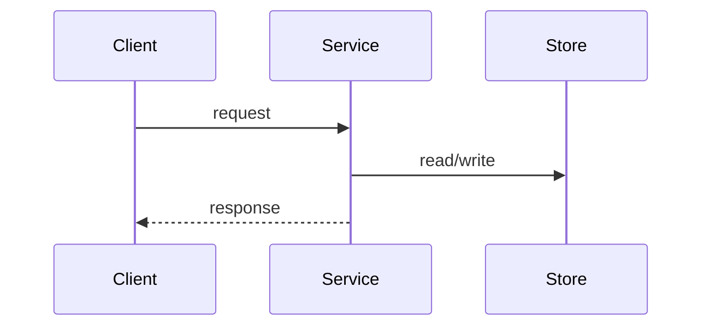

# Service Spec: {Title}

## Part I — Background And Goals

### Goal

{要实现的后端能力、业务链路或系统行为。}

### Non-goals

- {明确不做的管理后台、风控、迁移、运营工具等}

### Existing Context

| Source | Constraint | Impact |
|--------|------------|--------|
| code / API / schema / knowledge | | |

## Part II — System Design

### 2.1 Flow



### 2.2 API Contract

| Method | Path | Request | Response | Error Codes |
|--------|------|---------|----------|-------------|
| | | | | |

### 2.3 Data Model

```sql
-- Include only changed or newly introduced tables / columns.
-- Use N/A if this change has no schema impact.
```

### 2.4 State And Idempotency

| State / Key | Rule | Failure Behavior |
|-------------|------|------------------|
| idempotency key | | |
| lock / transaction | | |
| retry / compensation | | |

### 2.5 Design Decisions

| # | Decision | Rationale | Alternatives | Reversible? |
|---|----------|-----------|--------------|-------------|
| D-1 | | | | yes / no |

## Part III — Acceptance Criteria

### Happy Path

| # | Given | When | Then | Ref Step | Verification |
|---|-------|------|------|----------|--------------|
| AC-1 | | | | | |

### Failure And Compensation

| # | Fault / Condition | Expected State | Data / Money Impact | Verification |
|---|-------------------|----------------|---------------------|--------------|
| AC-2 | | | | |

### Permission / Security

| # | Given | When | Then | Verification |
|---|-------|------|------|--------------|
| AC-3 | | | | |

## Part IV — Release And Rollback

| Item | Plan | Owner / Evidence |
|------|------|------------------|
| config / env | | |
| migration / seed | | |
| smoke | | |
| rollout | | |
| rollback | | |

## Execution Policy

- Mode: `{plan|tdd}`
- Reason: {是否涉及状态机、幂等、权限、资金、安全、并发、历史回归}
- Source: model-selected | project-default | user-override
