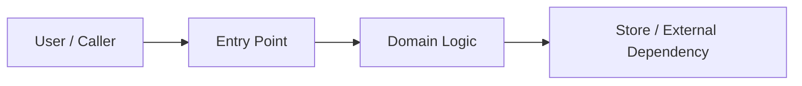

# Spec: {Title}

## Part I — Background And Goals

### 1.1 Intent

{用 1-3 句话说明：这个变更要解决什么问题，为什么现在要做，成功后用户/系统会发生什么变化。}

### 1.2 Scope

#### In

- {本次明确要交付的行为、模块、接口或用户可见结果}

#### Out

- {本次明确不做的内容，避免 AI 或 reviewer 自动扩张范围}

### 1.3 Context Basis

> 只放影响 Scope / AC / Risk / Execution Policy 的已采用上下文；不复制完整代码、知识库或聊天记录。没有外部依据时写 N/A。

| Source | Constraint / Fact | Impact |
|--------|-------------------|--------|
| user request | | |
| code / tests | | |
| docs / knowledge | | |
| open questions / conflicts | | |

### 1.4 Naming Conventions

> 只保留本次会触达的层；不涉及则写 N/A。

| Layer | Style | Example |
|-------|-------|---------|
| API JSON field | camelCase | `userId`, `itemName` |
| Code identifier | Project convention | `UserID`, `ItemID`, `user_id` |
| Database column | snake_case | `user_id`, `item_name` |
| Error / result code | Project convention | `ErrNotFound`, `ITEM_NOT_FOUND` |
| URL path | kebab-case resource noun | `/api/v1/items` |
| Config / env | UPPER_SNAKE_CASE | `ITEM_CACHE_TTL` |

## Part II — System Design

### 2.1 Technical Approach

| Item | Choice | Reason / Constraint |
|------|--------|---------------------|
| Language / framework | | |
| Storage / external service | | |
| Deployment / runtime | | |
| Compatibility boundary | | |

### 2.2 Architecture / Flow

> 用最小图表达模块依赖、核心流程、事务边界、锁/幂等 key 或外部调用；低风险任务可写 N/A。



### 2.3 Contract Surface

> 只列本次会改变或依赖的外部契约。没有则写 N/A。

| Contract | Change | Compatibility | Owner / Evidence |
|----------|--------|---------------|------------------|
| API / route | | | |
| Schema / data | | | |
| UI / component | | | |
| Config / env | | | |
| Events / jobs | | | |

### 2.4 API / Message Protocol

> 没有协议变更时写 N/A。JSON 示例必须是合法 JSON，不使用 `//` 注释。

| API / Message | Method / Type | Path / Topic | Auth | Request | Response / Event | Error Codes |
|---------------|---------------|--------------|------|---------|------------------|-------------|
| | | | | | | |

### 2.5 Data Model / Migration

> DDL、schema、配置或数据迁移必须说明兼容性、索引、回滚；无数据影响写 N/A。

```sql
-- Include only changed or newly introduced tables / columns.
-- Include indexes and rollback notes when applicable.
```

| Object | Index / Constraint | Purpose | Covered Flow / AC |
|--------|--------------------|---------|-------------------|
| | | | |

### 2.6 Design Decisions

> 只记录需要人审、不可轻易回滚、或会影响后续演进的决策。

| # | Decision | Rationale | Alternatives | Reversible? |
|---|----------|-----------|--------------|-------------|
| D-1 | | | | yes / no |

## Part III — Quality Bar

### 3.1 Acceptance Criteria

> AC 是 spec 的核心。每条 AC 都应该能被测试、人工验收或 gate 证明。

#### Happy Path

| # | Given | When | Then | Verification |
|---|-------|------|------|--------------|
| AC-1 | | | | unit / integration / e2e / manual / gate |

#### Validation / Permission / Policy

| # | Given | When / Condition | Then | Error / Result | Verification |
|---|-------|------------------|------|----------------|--------------|
| AC-2 | | | | | |

#### Failure / Compensation / Side Effects

| # | Fault / Condition | Expected State | Data / Side Effect | Verification |
|---|-------------------|----------------|--------------------|--------------|
| AC-3 | | | | |

#### Non-Functional Requirements

| # | Requirement / Command | Expected Result |
|---|-----------------------|-----------------|
| AC-n | build / lint / type-check | zero error |
| AC-n | focused tests | pass |

### 3.2 Risks And Invariants

> 高风险项必须明确不变量。低风险任务可以只写 N/A。

| Risk / Invariant | Mitigation | Verification |
|------------------|------------|--------------|
| idempotency / permission / data consistency / concurrency / regression | | |
| asset / billing / critical side effect | | |
| rollout / rollback / migration | | |

### 3.3 Review Checklist

> AI 先填写 Status 和 Evidence；reviewer 只需要验证是否评估过、引用是否准确。

| Category | Check | Status | Evidence / Design Basis |
|----------|-------|--------|-------------------------|
| Contract | API / schema / UI compatibility | todo / pass / n/a | |
| State | idempotency, transaction, retry, compensation | todo / pass / n/a | |
| Security | auth, permission, tenancy, privacy | todo / pass / n/a | |
| Data | migration, index, backfill, dangerous DML | todo / pass / n/a | |
| Reliability | timeout, fallback, cache, queue, scheduled job | todo / pass / n/a | |
| Release | rollout, rollback, observability, smoke | todo / pass / n/a | |

### 3.4 Test Strategy

| Test Layer | Scope | AC / Risk Covered | Command / Evidence |
|------------|-------|-------------------|--------------------|
| unit | | | |
| integration / contract | | | |
| e2e / manual | | | |
| concurrency / migration / rollback | | | |

## Part IV — Execution And Release

### 4.1 Execution Policy

- Mode: `{plan|tdd}`
- Reason: {为什么选这个模式}
- Source: `model-selected | project-default | user-override`
- Escalation: `plan -> tdd` allowed if new risk is discovered; `tdd -> plan` requires explicit user override.

### 4.2 Verification Plan

| Gate / Test | Required? | Evidence |
|-------------|-----------|----------|
| build | yes / no | |
| lint / type-check | yes / no | |
| unit test | yes / no | |
| AC coverage | yes / no | |
| integration / e2e | conditional | |
| drift / contract check | conditional | |

### 4.3 Release / Rollback Checklist

| Item | Plan | Owner / Evidence |
|------|------|------------------|
| config / env | | |
| migration / seed | | |
| observability / alert | | |
| rollout | | |
| rollback | | |
| smoke / post-check | | |

### 4.4 Approval

| Item | Value |
|------|-------|
| Status | explicit / inferred / skipped-with-reason |
| Source | user message / project default / reason |
| Notes | |

### 4.5 Open Questions

> 只保留会阻塞 Scope、AC、Risk 或 Execution Policy 的问题。

- [ ] {question}
